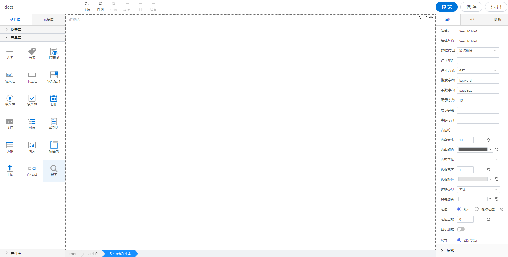

<h2>搜索框</h2>

---

**1\. 基本信息**



#### **组件简介**

> 名称：搜索框
>
> 功能：用于搜索并显示结果
>
> 使用场景：

#### **属性配置**

| 属性    | 描述信息         | 类型   | 默认值 | 设值方法                   | 取值方法   |
| :------ | :--------------- | :----- | ------ | -------------------------- | ---------- |
| 组件 ID | 控件 ID 自动生成 | string |        |                       |            |
| 组件名称    | 表单标识ID, 联动组件列表显示的名称       | string |  | setFormItemId | getFormItemId |
| 数据接口 | 搜索数据来源, 数据链接、对象服务 | boolean | false | setSelectApi | getSelectApi |
| 对象选择器 | 选择对象服务 |
| 请求地址 | 搜索请求地址 | string | | setSelectApi | getSelectApi |
| 请求方式 | 请求函数类型, GET、POST | string | GET | setSelectApi | getSelectApi |
| 搜索字段 | 请求键值 | string | keyword | setSelectApi | getSelectApi |
| 条数字段 | 请求条数的字段 | string | pageSize |  setSelectApi | getSelectApi |
| 展示条数 | 请求展示多少条 | number | 10 | setSelectApi | getSelectApi |
| 展示字段 | 搜索结果展示字段 | string | | setItemValue | getItemValue |
| 字段标识 | 搜索结果key的字段 | string | | setItemKey | getItemKey |
| 占位符 | 搜索框占位符 | string | | setPlaceholder | getPlaceholder |
| 内容大小 | 搜索框内容字体大小 | number | 14 | setContextFontSize | getContextFontSize |
| 内容颜色 | 搜索框内容字体颜色 | string | #000000 | setContextColor | getContextColor |
| 内容字体 | 搜索框内容字体 | string | | setContextFontFamily | getContextFontFamily | 
| 边框宽度 | 搜索框边框宽度 | number | 1 | setBorderWidth | getBorderWidth |
| 边框颜色 | 搜索边框颜色 | string | #e3e3e3 | setBorderColor | getBorderColor |
| 边框类型 | 搜索边框类型, 实线、点线、虚线 | | | setBorderStyle | getBorderStyle | 
| 背景颜色 | 搜索背景颜色 | string | #ffffff | setBackgroundColor | getBackgroundColor |

#### **联动配置**
| 类型     | 方法       | 返回数据(作为源)/ 方法赋值（作为目标）| 描述 |
| -------- | -------- | ------------------ | ---- |
| 作为源	| 初始化 | 通过任意方式设置初始化的值 | 初始化设置值之后触发 |
| 作为源	| 值改变 | 值改变之后 的值 | 值改变之后触发 |
| 作为源	| 失去焦点 | 失去焦点 的值 | 失去焦点之后触发 |
| 作为源	| 回车 | 回车 的值 | 回车之后触发 |
| 作为目标	| 设置值 | 设置搜索框的值 | 设置搜索框的值 |

#### **示例代码**

```javascript
  // 获取Id为SearchCtrl-1的元素
  var searchCtrl = window.supQuery.getInstanceById('SearchCtrl-1'); 

  // 组件名称
  searchCtrl.setFormItemId('UploadImg-1');
  const ctrlName = searchCtrl.getFormItemId();

  // 搜索请求相关配置
  searchCtrl.setSelectApi({
    builtInInterface: false,  // 数据接口, true为对象服务, false为数据链接
    api: '',  //  请求地址
    method: 'GET', // 请求方式,  GET, POST
    page: 'pageSize', // 条数字段
    pageSize: 10, // 展示条数
    keyword: 'keyword', // 搜索字段
    selectedObject: '', // 选中的对象服务
  })

  // 设置展示字段
  searchCtrl.setItemValue('name');
  const itemValue = searchCtrl.getItemValue();

  // 设置字段标识
  searchCtrl.setItemKey('id');
  const itemKey = searchCtrl.getItemKey();

  // 设置占位符
  searchCtrl.setPlaceholder('请输入');
  const placeholder = searchCtrl.getPlaceholder();

  // 设置内容大小
  searchCtrl.setContextFontSize(20);
  const fontSize = searchCtrl.getContextFontSize();

  // 设置内容颜色
  searchCtrl.setContextColor('red');
  const color = searchCtrl.getContextColor();

  // 设置内容字体
  searchCtrl.setContextFontFamily('微软雅黑');
  const fontFamily = searchCtrl.getContextFontFamily();
  
  // 设置边框宽度
  searchCtrl.setBorderWidth(2);
  const borderWidth = searchCtrl.getBorderWidth();

  // 设置边框颜色
  searchCtrl.setBorderColor('blue');
  const borderColor = searchCtrl.getBorderColor();

  // 设置边框类型, 实线(solid), 点线(dotted), 虚线(dashed)
  searchCtrl.setBorderStyle('solid');
  const borderStyle = searchCtrl.getBorderStyle();

  // 设置背景颜色
  searchCtrl.setBackgroundColor('red');
  const backgroundColor = searchCtrl.getBackgroundColor();

```
