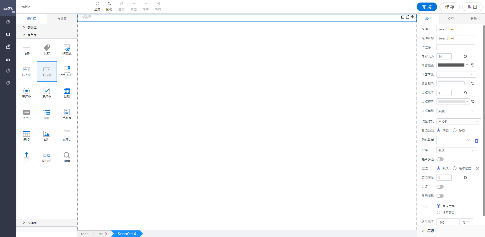

<h2>下拉框</h2>

---

**1\. 基本信息**

{.img-fluid tag=1}

#### **组件简介**

> 名称：下拉框
>
> 功能：用于下拉选择的数据
>
> 使用场景：用于下拉选择的场景

#### **属性配置**

| 属性     | 描述信息        | 类型     | 默认值         | 设值方法          | 取值方法     |
| ------- | ------------- | ---------- | -------- | ---------------- | ------------ |
| 组件id  | 该控件唯一标识   |            |          |                   |              |
| 组件名称 | 控件命名       | Object      |          | setFormItemId\({value: String}\)        | getFormItemId\(\).value                    |
| 占位符   | 下拉框的占位符  | Object      |           | setPlaceholder\({value: String}\)       | getPlaceholder\(\).value                 |
| 内容文本 | 下拉框框内内容的大小/颜色/字体    | Object  | 14 /  'rgba\(0, 0, 0, 0\.65\)' /  微软雅黑 | setContextText\({fontSize: number, color: string, fontFamily: string}\) |getContextText\(\)  |
| 背景颜色 | 下拉框框内内容的背景颜色  | Object     | \#fff                    | setBackgroundColor\({color: String}\)   | getBackgroundColor\(\).color               |
| 边框宽度 | 下拉框边框的宽度  | Object        | 1                        | setBorderWidth\({value: number}\)       | getBorderWidth\(\).value                   |
| 边框颜色 | 下拉框边框的颜色  | Object           | \#E3E3E3                 | setBorderColor\({color: String}\)       | getBorderColor\(\).color                   |
| 边框类型 | 下拉框边框的类型  | Object: {value: ‘solid’ / ‘dotted’ / ‘dashed’} |            | setBorderStyle\({value: String}\)       | getBorderStyle\(\).value                   |
| 校验时机 | 运行期是否对控件输入框内进行校验或者选择什么时机进行检验 | object       |                          | setValidityCheck\(Object\)     | getValidityCheck\(\)                 |
| 是否必填 | 运行期控件输入框内内容是否必填     | ’true‘ / 'false'              | 'false'     | setValidityCheck\(Object\)     | getValidityCheck\(\)\.isRequired     |
| 备选类型 | 下拉选项类型   | object   | 动态          | setDataSource\(Object\)   | getDataSource\(\)\.type              |
| 动态数据 | 通过对象选择器绑定动态数据渲染下拉选项    | object                        | \-      | setDataSource\(Object\)        | getDataSource\(\)\.dynamicDataSource |
| 静态数据 | 手动添加数据渲染下拉选项      | object                        | \-         | setDataSource\(Object\)        | getDataSource\(\)\.staticDataSource  |
| 排序     | 下拉框数据进行排序     | ’ordinary‘ / ’up‘ / ’down‘    | 'ordinary'     | setListOrder\({value: String}\)         | getListOrder\(\).value                     |
| 是否多选 | 配制下拉框是否支持多选    | {value: boolean}            | true / false     | setIsMultiple\({value: boolean}\)       | getIsMultiple\(\).value                    |
| 只读     | 表单控件的只读选项     | {value: boolean}           | false              | setReadOnly\({value: boolean}\)         | getReadOnly\(\).value                      |
| 显示加载 | 运行期是否显示加载动画    | {value: boolean}           | false               | setIsShowLoading\({value: boolean}\)    | getIsShowLoading\(\).value                 |


#### **公共属性配置**： [定位/尺寸/组件宽高设置](../../../CommonIntro/commonProp.md)

#### **公共交互配置**： [交互配置](../../../CommonIntro/action.md)

#### **公共联动配置**： [联动](../../../CommonIntro/link.md)

#### **联动配置**

| 类型     | 方法   | 描述                           | 返回数据\(作为源\) | 方法赋值（作为目标） |
| -------- | ------ | ------------------------------ | ------------------ | -------------------- |
| 作为源   | 初始化 | 各种方式初始化设置值之后触发   | 初始化的值         |                      |
| 作为源   | 值改变 | select选中内容发生改变之后触发 | 值改变之后 的值    |                      |
| 作为目标 | 设置值 | 源数据的数据设置成该select的值 |                    | 设置select的值       |
| 作为目标 | 查询   | 重新获取绑定数据源的数据       |                    | 查询数据             |


#### **联动公共配置项**
| 格式转换（作为源\-返回的数据处理） | 源字段（作为源）                                      |
| ---------------------------------- | ----------------------------------------------------- |
| 自定义                             | label ： 获取数据中的label；value ：获取数据中的value |


#### **示例代码**


##### Select 下拉框控件

Select 选项配置方式有三种

- 动态绑定对象的属性
- 绑定静态数据源
- 通过脚本设置

##### 获取控件虚拟 DOM：

```javascript
  var selectCtrl = instance; // 或者 window.supQuery.getInstanceById('XXX');
```

##### 获取选中的值：

```javascript
  instance.getValue();
```

##### 设置选中的值:

```javascript
  instance.setValue('1');
```

##### 导入 select 选项:

```javascript
 var data = [
      {
        optionText: '男', 
        optionValue: '1'
      },
      {
        optionText: '女',
        optionValue: '2'
      }
  ];
  instance.setImportData(data);
```

##### 脚本设置 select 是否多选:

```javascript
  instance.setIsMultiple({ value: true });
```