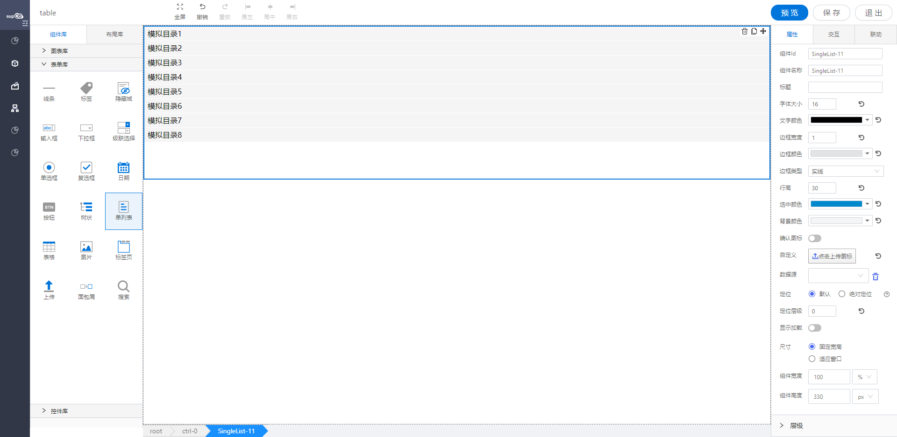

<h2>单列表</h2>

---

**1\. 基本信息**

{.img-fluid tag=1}

#### **组件简介**

> 名称：单列表
>
> 功能：用于用户输入
>
> 使用场景：

#### **属性配置**

| 属性     | 描述信息                        | 类型                    | 默认值      | 设值方法                   | 取值方式                         |
| -------- | ------------------------------| -----------------------| ------------| -------------------------| --------------------------------|
| 组件ID   | 控件ID，该组件的唯一标识， 自动生成    | string              |               |                                    |                             |
| 组件名称 | 控件的组件名称，用于联动key和表单提交  | Object               | 同组件ID      | setFormItemId\({value:String}\)            | getFormItemId\(\).value             |
| 标题     | 标题文字                               | Object          |               | setTitle\({value:String}\)                 | getTitle\(\).value                 |
| 字体大小 | 字体的大小                             | Object           | 16            | setFontSize\({value:number}\)              | getFontSize\(\).value              |
| 文字颜色 | 文字 的颜色                            | Object           | \#000000      | setFontColor\({color:String}\)             | getFontColor\(\).color             |
| 边框宽度 | 默认边框大小为1，可自定义              | Object             | 边框大小为1   | setBorderWidth\({value:number}\)           | getBorderWidth\(\).value             |
| 边框类型 | 默认为实线，边框类型：实线、点线、虚线 | { value: 'solid' / 'dotted' / 'dashed'} | 实线: 'solid' | setBorderStyle\({value:String}\)  | getBorderStyle\(\).value   |
| 边框颜色 | 边框颜色可自定义配置                   | Object             | \#E3E3E3      | setBorderColor\({color:String}\)           | getBorderColor\(\).color           |
| 行高     | 行高                                   | Object          | 30            | setLineHeightStyle\({value:number}\)       | getLineHeightStyle\(\).value       |
| 选中颜色 | 选中状态的颜色                         | Object            | \#0088CC      | setSelectBackgroundColor\({color:String}\) | getSelectBackgroundColor\(\).color |
| 背景颜色 | 背景颜色                               | Object           | \#f5f5f5      | setBackgroundColor\({color:String}\)       | getBackgroundColor\(\).color       |
| 确认图标 | 确认图标                               | Object          | false         | setIsShowIcon\({value:boolean}\)                  | getIsShowIcon\(\).value     |
| 自定义   | 可以自定义按钮的图标                   | string             | 无            | setIconUpload\(string\)                  | getIconUpload\(\)                 |
| 数据源   | 动态数据的数据源                       | Object            |               | setObjectLabel\(object\)           | getsetObjectLabel\(\)\.dataSource |


#### **公共属性配置**： [定位/尺寸/组件宽高设置](../../../CommonIntro/commonProp.md)

#### **公共交互配置**： [交互配置](../../../CommonIntro/action.md)

#### **公共联动配置**： [联动](../../../CommonIntro/link.md)

#### **联动配置**

| 类型     | 方法     | 描述                           | 返回数据\(作为源\) | 方法赋值（作为目标） |
| -------- | -------- | ------------------------------ | ------------------ | -------------------- |
| 作为源   | 初始化   | 各种方式初始化设置值之后触发   | 初始化的值         | \-                   |
| 作为源   | 点击行   | select选中内容发生改变之后触发 | 点击行的值         | \-                   |
| 作为目标 | 设置选中 | 源数据的数据设置成该select的值 | \-                 | 设置当前选中的值     |
| 作为目标 | 查询     | 重新获取绑定数据源的数据       | \-                 | 查询数据             |


#### **示例代码**

##### 获取单列表
```javascript
  var singleList = instance; // 或者 window.supQuery.getInstanceById('XXX')

```

##### 动态绑定数据源数据格式

```javascript
   var data = {
    list: [
      {
       	label: 'name',
        value: 'showName'
      },
     {
       	label: 'name1',
        value: 'showName1'
      }
    ]
  }

```

##### 设置选中

```javascript
  instance.setValue('XXXX');

```