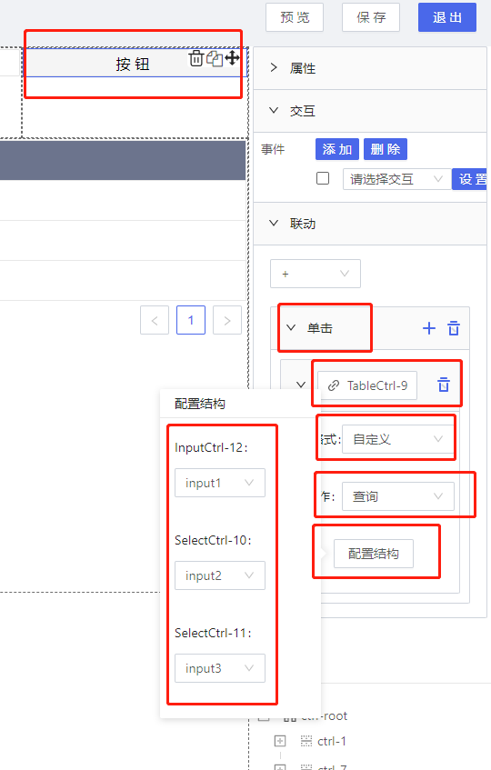

<h2>TableCtrl 表格控件</h2>

---

**1\. 基本信息**

{.img-fluid tag=1}

#### **组件简介**

> 名称：表格
>
> 功能：数据展示
>
> 使用场景：数据批量展示

#### **属性配置**

| 属性                     | 描述信息                  | 类型                      | 默认值         | 设值方法                            | 取值方法                               |
| ------------------------ | ---------------------- | -------------------------| ------------ | ------------------------------------| ------------------------------------ |
| 组件ID                   | 控件ID，该组件的唯一标识， 自动生成           | string    |                |                                   |                              |
| 组件名称                 | 控件的组件名称，用于联动key和表单提交         | Object    |                | setFormItemId\({value: String}\)          | getFormItemId().value         |
| 标题                     | 表格的标题                                | Object   | \-             | setLabelContent\({value: String}\)            | getLabelContent\(\).value     |
| 字体颜色                 | 表格标题的字体颜色                          | Object   | \#000000       | setLabelContentFontColor\({color: String}\)  | getLabelContentFontColor\(\).color  |
| 字体大小                 | 表格标题的字体大小                          | Object   | 14             | setLabelContentFontSize\({value: Number}\)      | getLabelContentFontSize\(\).value    |
| 校验时机                 | 表格的校验时机， 不校验或者内容改变校验       | Object     | 不校验         | setValidityCheck\(object\)             |   getValidityCheck\()    |
| 表头固定                 | 默认固定， 表头固定之后，表身高度会自适应滚动 | {value: 'true' / 'false' }   | 固定           | setIsFixedHeader\({value: String}\)             | getIsFixedHeader\(\).value   |
| 列宽调整                 | 表格列宽拖动调整表格列                        | Object            | false          | setIsDragChangeWidth\({value: Boolean}\)    | getIsDragChangeWidth\(\).value    |
| 是否可选                 | 默认不可选，可选，表格左方会加一个select选项  | {value: 'true' / 'false' }       | 不可选         | setIsSelected\({value: String}\)            | getIsSelected\(\).value  |
| 边框                     | 默认有边框                           | {value: 'true' / 'false' }         | 有边框         | setBorder\({value: String}\)                  | getBorder\(\).value    |
| 外边框                   | 默认有外边框                          | {value: 'true' / 'false' }        | 有外边框       | setBorderOut\({value: String}\)                | setBorderOut\(\).value  |
| 边框宽度                 | 默认边框大小为1，可自定义               | Object                 | 边框大小为1    | setBorderWidth\({value: Number}\)               | getBorderWidth\(\).value |
| 边框颜色                 | 边框颜色可自定义配置                   | Object            | \#E8E8E8       | setBorderColor\({color: String}\)           | getBorderColor\(\).color    |
| 边框类型                 | 默认为实线，边框类型：实线、点线、虚线     | { value: 'solid' / 'dotted' / 'dash' } | 实线: 'solid'  | setBorderStyle\({value: String}\)        | getBorderStyle\(\).value    |
| 显示表头                 | 表头                                 | Object                | false          | setHasThead\({value: boolean}\)               | getHasThead\(\).value     |
| 表头背景                 | 表头背景可自定义                       | Object                 | \#6C748D       | setTheadBackgroundColor\({color: String}\)  | getTheadBackgroundColor\(\).color  |
| 字体颜色                 | 表头字体颜色可自定义                   | Object                 | \#FFFFFF       | setTheadText\({theadFontColor: String}\)   | getTheadText\(\).theadFontColor |
| 字体大小                 | 表头字体大小可自定义                   | Object                 | 14             | setTheadText\({theadFontSize: String}\)             | getTheadText\(\).theadFontSize  |
| 字体                     | 字体可自定义                         | Object                 | 微软雅黑       | setTheadText\({theadFontFamily: String}\)           | getTheadText\(\).theadFontFamily  |
| 表身背景                 | 表头背景可自定义                       | Object                 | \#FFFFFF    | setTbodyBackgroundColor\({color: String}\)  | getTbodyBackgroundColor\(\).color|
| 字体颜色                 | 表头字体颜色可自定义                   | Object                  | \#000000       | setTbodyText\({theadFontColor: String}\)   | getTbodyText\(\).theadFontColor  |
| 字体大小                 | 默认字体大小14，表头字体大小可自定义     | Object                  | 14             | setTbodyText\({theadFontSize: String}\)             | getTbodyText\(\).theadFontSize   |
| 字体                     | 默认字体微软雅黑，字体可自定义          | Object                 | 微软雅黑       | setTbodyText\({theadFontFamily: String}\)           | getTbodyText\(\).theadFontFamily   |
| 表格高度                 | 可自定义，最小可调都26                 | Object                 | 44             | setTdHeight\({value: Number}\)                  | getTdHeight\(\).value        |
| 单行颜色                 | 可自定义                             | Object              | \#FFFFFF  | setSingleRowColor\({color: String}\)    | getSingleRowColor\(\).color     |
| 双行颜色                 | 可自定义                             | Object              | \#FFFFFF       | setDoubleRowColor\({color: String}\)   | getDoubleRowColor\(\).color  |
| 滚动条                   | 滚动条的背景颜色                      | Object             | false          | setIsTransparent\({value: boolean}\)            | getIsTransparent\(\).value  |
| 滚动宽度                 | table可滚动长度,滚动宽度要大于组件宽度   | Object              | 0              | setTableX\({value: Number}\)                    | getTableX\(\).value |
| 数据源                   | 绑定数据源，可以绑定属性和服务           | Object               | \-             | setObject\(object\)                    | getObject\(\)  |
| 是否分页                 | 是否显示分页                          | {value: 'true' / 'false' }       | 分页: 'true'   | setIsPagination\({value: String}\)              | getIsPagination\(\).value  |
| 每页条数                 | 每页条数 pageSize                     | Object               | 5              | setPageSize\({value: Number}\)                  | getPageSize\(\).value  |
| 是否允许导入             | 导入按钮                              | Object              | false          | setIsImport\({value: boolean}\)                 | getIsImport\(\).value   |
| 是否允许导出             | 导出按钮                               | Object             | false          | setIsExport\({value: boolean}\)                 | getIsExport\(\).value  |
| 导入导出样式             | 导入导出样式:图片/按钮（image/button）    | {value: 'image' / 'button' }   | image          | setPortStyle\({value: String}\)                 | getimage\(\).value   |
| 工具栏颜色               | 导入导出工具栏颜色                      | Object      | \#6C748D   | setImportAndExportBackground\({color: String}\) | getImportAndExportBackground\(\).value  |
| 是否采用导入导出复杂模式 | 导入导出复杂模式                          | object               | false         | setComplexConfig\(object\)             | getComplexConfig\(\)\.isComplex  |
| 复杂情况导入服务路径     | 导入服务路径                             | object              |               | setComplexConfig\(object\)             | getComplexConfig\(\)\.complexImportUrl |
| 复杂情况导出服务路径     | 导出服务路径                             | object              |               | setComplexConfig\(object\)             | getComplexConfig\(\)\.complexExportUrl |
| 表头设置                 | 可配置表头 详见下方 表头列设置           | Array                | 返回的所有数据 | setBindingTableHeaderSource\(Array\)   | getBindingTableHeaderSource\(\)       |
| 定时刷新                 | 定时刷新                             | Object                | false          | setIsTiming\({value: boolean}\)                 | getIsTiming\(\).value    |
| 刷新频率                 | 定时刷新的时候的频率                   | Object                 |                | setDelayTime\({value: Number}\)                       | getDelayTime\(\).value   |

#### **公共属性配置**： [定位/尺寸/组件宽高设置](../../../CommonIntro/commonProp.md)

#### **公共交互配置**： [交互配置](../../../CommonIntro/action.md)

#### **表头列设置**

>  属性配置：以下的表头列的配置可以通过上面的页面配置，一些扩展比较高的需要自行脚本维护。

{.img-fluid tag=1}


| 名称         | Key          | 描述                                                                                                                       | 类型                                                            | 默认值 |
| ------------ | ------------ | -------------------------------------------------------------------------------------------------------------------------- | --------------------------------------------------------------- | ------ |
| 字段         | originalName | 数据返回的字段key值                                                                                                        | string                                                          |        |
| 显示名       | customName   | 数据key对应的显示名称                                                                                                      | string                                                          |        |
| 宽度         | width        | 列宽度设置                                                                                                                 | number                                                          |        |
| 对齐方式     | align        | 表头和表格数据对齐方式：左对齐，居中对齐，右对齐                                                                           | string                                                          | 左对齐 |
| 是否展示tips | hasTips      | 当行展示显示，用省略号来标识,  true 'true' 或者 ‘是’ 都代表显示tips                                                        | string                                                          | 否     |
| 数据类型     | type         | 数据的显示类型，图片格式（image），时间格式：年月日（date）、年月日时分秒（dateTime）、时分秒（time）                      | string                                                          | \-     |
| 数据渲染     | render       | 原始数据经过二次渲染的数据,入参有 text（当前数据）0,row（当前行数据）,index（当前行数据下标）,table（当前table所有的数据） | function\(text,row,index,table\)\{   return text; // 填写部分\} | \-     |
| 筛选         | isFilter     | 是否支持后端筛选                                                                                                           |                                                                 |        |
| 后端排序     | sorterB      | 是否支持后端排序                                                                                                           |                                                                 |        |


> 以下为页面不可配置项， 可通过脚本的形式去配置

| 名称                          | Key              | 描述                                                                                                       | 类型                                                                   | 默认值        |
| ----------------------------- | ---------------- | ---------------------------------------------------------------------------------------------------------- | ---------------------------------------------------------------------- | ------------- |
| 行内编辑                      | editable         | 判断是否需要行内编辑， true 'true' 或者 ‘是’ 都代表存在行内编辑                                            | string、boolean                                                        | false         |
| 行内编辑类型                  | formType         | ‘String’或 ‘Select ’                                                                                       | string                                                                 | ‘String’      |
| 行内编辑可选数据源            | formTypeSource   | 用于行内编辑类型是‘Select’的情况，每一行的数据都一样，例如： \[\{"code":"11"\},\{"code":"22"\}\]           | function（）\{  return Array; // 返回数据是数组\}                      | \-            |
| 行内动态获取数据              | formTypeSourceFn | 用于行内编辑类型是‘Select’的情况，可选的是动态获取的，每一行的数据都不一样                                 | function（）\{  return Array; // 返回数据是数组\}                      | \-            |
| 行内编辑的回调（handleSave ） | handleSave       | 行内编辑选中或者失去焦点之后的回调事件                                                                     | function（）\{  // 选中和失去焦点是后执行的操作\}                      | \-            |
| 行内编辑是否可以保存          | isHandleSave     | 行内编辑选中或者失去焦点之后，判断是否需要执行回调事件，方法 return true；代表可以执行回调，false 则不行。 | function（）\{  // promise异步 或者 return true、false\}               | return true； |
| 行内编辑是否可以编辑          | isEditFn         | 判断有行内编辑的字段是否需要行内编辑的功能，例如，有写虽然设置了行内编辑，但是因为某个参数就不需要编辑。   | function\(row\)\{  return true;// true代表可以编辑，false 为不可编辑\} | return true； |
| 行内编辑是否必填              | isRequired       | 行内编辑的字段是否一定要填写，不填写就会有报错信息，只做必填校验                                           | string、boolean                                                        | false         |


**设置表头示例代码**

> 配置参数 序号的字段默认为 _index 操作的字段默认为 'operation'

```
var columnHeader = [
  {
    customName: '序号',
    originalName: '_index',
    align:'left',
    width: 100
  },
  {
    customName: '名称',
    originalName: 'name',
    align:'left',
    isFilter: true, // 筛选
    sorterB: true,// 后端排序
    // 自定义渲染
    render: function(text,row,index,table){
        console.log(text,row,index,table);
        return '<span>名称：'+text+'</span>';
    }
  },
  {
    customName: '生日',
    originalName: 'birthday',
    align:'left'
  },
  {
    customName: '年纪',
    originalName: 'age',
    align:'left',
    editable: true, // 行内编辑
    handleSave: function(originalName, row){
      console.log('行内编辑保存', originalName, row);
    },
    isHandleSave: function(originalName, row, tableData) {
        console.log('行内编辑是否保存',originalName, row, tableData);
        return true;
    },
    isEditFn: function(keyItem){
      console.log('keyItem', keyItem);
      return true;
    },
    isRequired: true
  },
  {
    customName:'操作',
    originalName:'operation',
    align:'left'
  }
];
table.setColumnHeader(columnHeader);
```

#### **联动配置**

| 类型     | 方法   | 返回数据\(作为源\)/ 方法赋值（作为目标） | 描述                     |
| -------- | ------ | ---------------------------------------- | ------------------------ |
| 作为源   | 行选择 | 当前行的数据 \{ key: name \}             | 点击行的时候会触发       |
| 作为目标 | 查询   | 查询数据                                 | 重新获取绑定数据源的数据 |

#### **重中之重**

1. 选中表格控件， 在表格的交互中， instance 可直接代表当前的控件；
2. 在其他控件或者自己中， 交互取表格控件， 用  window.supQuery.getInstanceById('XXXX') 也可代表table控件；

```
var table= instance; // instance 默认为当前元素
或
var table= window.supQuery.getInstanceById('table-1') // 获取Id为table-1的元素， 代表控件ID

```
#### **表格脚本说明**

1. 单元格内容的特殊定制（提供链接、功能按钮的输入，内置或外置图标，提供单元格背景颜色的修改）
2. 单元格内容的自动合并和分栏分列
3. 单元格的行内编辑
4. 单元格的多选功能
5. 表格表头的固定
6. 表格提供分页属性的配置
7. 表格的字段排序

### **获取Table 元素**

```
var table = instance; 
或 
var table= window.supQuery.getInstanceById('table-1')
```
### **设置数据源**
```
var rows = {
  list: [
    {
      index: '1',
      id: 'H111',
      name:'集装箱',
      nickName: '物料名称',
      request: 1,
    },
    {
      index: '3',
      id: 'H112',
      name: '垃圾箱',
      nickName: '物料名称',
      request: 1,
    },
    {
      index: '2',
      id: 'H110',
      name: '集装箱',
      nickName: '物料名称',
      request: 1
    },
    {
      index: '4',
      id: 'H111',
      name: '工业箱',
      nickName: '物料名称',
      request: 1,
    },
  ],
  // 需要分页加分页信息，不需要就不加
  pagination:{
    current:1,
    pageSize:1,
    total:5
  }
};

table.setObjectSource(rows);
```

#### **设置操作**


- name 按钮的名字

- modalUrl 弹窗的pageId

   modalTitle  弹窗标题

   modalWidth  弹窗宽度

   modalHeight  弹窗  

   params  url带的入参，数据来源于当前数据

- click 点击事件  入参: row, index, tableData

- isRenderFn(row) 根据不同的情况，是否显示按钮 true: 显示； false： 不显示

- style 样式

```
var columnOperation = [
  {
    name:'编辑',
    modalUrl:'page_id',
    modalTitle:'编辑',
    modalWidth: 1000,
    modalHeight:700,
    params:['id']
  },
  {
    name:'删除',
    click:function(row, index, tableData){
      console.log('删除', row, index, tableData);
    },
    isRenderFn: function(row){
     return true;
    },
    style: {
      backgroundColor:'#eacd4a',
      color:'#fff'
    }
  }
];
table.setColumnOperation(columnOperation);
```

#### **设置列单元格**

- 字段名 ：name
- 单元格样式 style 
- 弹窗的   modalUrl: pageId
          modalTitle  弹窗标题
          modalWidth  弹窗宽度
          modalHeight  弹窗 
- 新链接跳转   hrefUrl
- icon 内置图标
- onClick 点击事件 入参： row， tableData

name 代表key值，表格里的key ，对该单元格进行配置
```
var cellConfig={
 name: {
    modalUrl:'pageId',
    modalWidth:1000,
    style:{
      color:'#eacd4a'
    },
  },
 age: {
    style:{
      backgroundColor:'#eacd4a',
      color:'#fff'
    },
    hrefUrl:'http://www.baidu.com'
  }
};

table.setCellConfig(cellConfig);

```
#### **合并单元格**

1. groupBy 分组合并
2. sumGroupBy 需要求和的分组
3. getSumKeys  数组 需要求和或者合并的字段名的数组
4. getSumOnlyMergerKeys  数组 需要求和或者合并的字段名中 只需要合并不求值的字段
5. notMerger  数组 不参与合并的字段名

```
var mergerCell={
  groupBy:'name',
  sumGroupBy:'name',
  getSumKeys:['request'],
  getSumOnlyMergerKeys:[],
  notMerger:['id','index','operation']
}

table.setMergerCell(mergerCell);
```

#### **脚本分页配置**

```
var onChange=function(pangation,filters,sorter){
  console.log(pangation,filters,sorter);
  // 通过页面获取数据 更新数据 pangation 分页更新 
  // pangation  {current: 1, pageSize: 1, total: 5}
  // filters 过滤
  // sorter 排序  {column:{},field:"request",order:"descend"}

  // todo
  table.setObjectSource(row);
}

table.setTableOnChange(onChange);

```
####  **获取选择的元素**

```
var selects = table.getSelectedRows();
console.log('selects', selects);
```

#### **获取当前行**

```
var curRow = table.getCurRow();
console.log('curRow', curRow);
```

#### **获取当前数据源**

```
var tableData = table.getObject();
console.log('tableData', tableData);
```


####  **重新获取数据**

```
var tableData = table.reloadTableData();

```
#### **公共联动配置**： [联动](../../../CommonIntro/link.md)

### **联动设置**

1. 没有按钮的触发搜索 
   - 入参为 输入框/选择框等表单控件， 按住Ctrl 选中当前三个元素， 点击右边联动的 选择目标，点击Table， 弹出下图。

   - 联动的配置 第一列是三个控件触发的事件， 例如初始化/值改变等， 编辑格式：自定义格式或者默认格式，动作： 查询

   - table 需要绑定 数据源，这样入参的改变，table会重新发起查询

   {.img-fluid tag=1}


2. 有按钮的触发搜索
  - 入参为 输入框/选择框等表单控件， 三个表单分三次设置， 选中输入框，联动-值改变-目标选按钮控件，动作为存储值，编辑格式自定义，按照自己的需求来， 三个控件需要将三个都和按钮联动， 如图1：


图1：
  {.img-fluid tag=1}


 - table需要绑定数据源， 有入参的数据源

  - 表单联动设置完，设置按钮联动，点击按钮，选中联动-单击-目标选table控件-动作查询， 会生成下面的配置结构， 点开配置结构，三个绑定的表单控件，可以自动选中数据源的三个入参，根据需求自由选择

  
图2：

   {.img-fluid tag=1}