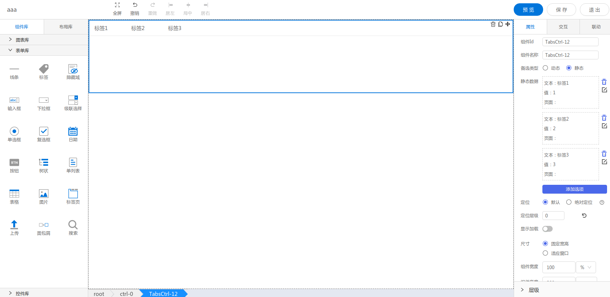

<h2>标签页</h2>

---

**1\. 基本信息**



#### **组件简介**

> 名称：标签页
>
> 功能：用于多个页面方便的切换
>
> 使用场景：

#### **属性配置**

| 属性    | 描述信息         | 类型   | 默认值 | 设值方法                   | 取值方法   |
| :------ | :--------------- | :----- | ------ | -------------------------- | ---------- |
| 组件 ID | 控件 ID 自动生成 | string |        |                       |            |
| 组件名称    | 表单标识ID, 联动组件列表显示的名称       | string |  | setFormItemId | getFormItemId |
| 备选类型 | 标签页数据源类型 | string | 静态(static) | setDataSelection | getDataSelection |
| 静态数据 | 自行添加的数据源 | object | | setDataSelection | getDataSelection |
| 动态数据 | 从对象实例获取的数据 | object | | setDataSelection | getDataSelection |

#### **联动配置**
| 类型     | 方法       | 返回数据(作为源)/ 方法赋值（作为目标）| 编辑格式（作为源-返回的数据处理）| 源字段(作为源) | 描述 |
| -------- | -------- | ------------------ | ---------------- | ----- | ---- |
| 作为源	| 点击标签 | 点击标签页tab的key | 无 | text(选项文本),  value(选项的值) | 点击标签页tab的key |
| 作为目标 | 设置选中 |	设置选中的tab |	无 | 无 | 设置选中哪个tab |


#### **示例代码**

```javascript
  // 获取Id为TabsCtrl-1的元素
  var tabsCtrl = window.supQuery.getInstanceById('TabsCtrl-1'); 

  // 组件名称
  tabsCtrl.setFormItemId('TabsCtrl-1');
  const ctrlName = tabsCtrl.getFormItemId();

  // 设置数据源
  tabsCtrl.setDataSelection({
      type: 'static',  // 数据类型, static(静态), dynamic(动态)
      dataSource: [{

      }],
      dynamicDataSource: [], // 动态数据
      staticDataSource: {list: []}, // 静态数据
  })
  const dataSource = tabsCtrl.getDataSelection();

  // 设置当前激活的tab, key为数据源项的key
  tabsCtrl.setActiveKey(key);

  // 获取选中的tab的信息
  const chooseOption = tabsCtrl.getChooseOption();

```
