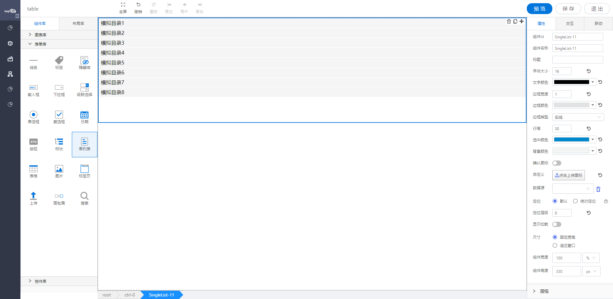

<h2>树状</h2>

---

**1\. 基本信息**

{.img-fluid tag=1}

#### **组件简介**

> 名称：树状
>
> 功能：用于树型展示数据
>
> 使用场景：用于树型展示数据

#### **属性配置**

| 属性     | 描述信息                                 | 类型    | 默认值   | 设值方法                        | 取值方式                 |
| -------- | ---------------------------------------- | ------- | -------- | ------------------------------- | ------------------------ |
| 组件ID   | 控件ID，该组件的唯一标识， 自动生成      | string  |          |                                 |                          |
| 组件名称 | 控件的组件名称，用于联动key和表单提交    | Object  | 同组件ID | setFormItemId\({value: String}\)         | getFormItemId\(\).value        |
| 标题     | 标题文字                                 | Object  | ''       | setLabelContent\({value: String}\)       | getLabelContent\(\).value      |
| 是否搜索 | 树型控件有搜索选项                       | Object | false    | setIsSearch\({value: boolean}\)          | getIsSearch\(\).value          |
| 是否展开 | 树型控件是否默认展开                     | Object | false    | setIsExpended\({value: boolean}\)        | getIsExpended\(\).value        |
| 取消权限 | 绑定的工厂模型展示对象实例               | Object | false    | setIsPermission\({value: boolean}\)      | getIsPermission\(\).value      |
| 默认选中 | 属性控件默认选中第一个元素               | Object | false    | setisDefaultSelected\({value: boolean}\) | getisDefaultSelected\(\).value |
| 选中颜色 | 选中状态的颜色                           | Object  | \#0088CC | setSelectedBgColor\({color: string}\)    | getSelectedBgColor\(\).color   |
| 选中颜色 | 背景颜色                                 | Object  | \#f5f5f5 | setSelectedFontColor\({color: string}\)  | getSelectedFontColor\(\).color |
| 选中字号 | 选中字号的大小                           | Object  | 16       | setSelectedFontSize\({value: String}\)         | getSelectedFontSize\(\).value  |
| 数据源   | 绑定对象实例\-属性/ 对象实例\-服务 /网络 | object  | \-       | setDataSource\(object\)         | getDataSource\(\)        |


#### **公共属性配置**： [定位/尺寸/组件宽高设置](../../../CommonIntro/commonProp.md)

#### **公共交互配置**： [交互配置](../../../CommonIntro/action.md)

#### **公共联动配置**： [联动](../../../CommonIntro/link.md)

#### **联动配置**

| 类型     | 方法       | 描述                         | 返回数据\(作为源\)   | 方法赋值（作为目标） |
| -------- | ---------- | ---------------------------- | -------------------- | -------------------- |
| 作为源   | 初始化     | 各种方式初始化设置值之后触发 | 初始化的值           | \-                   |
| 作为源   | 点击树节点 | 该控件点击当前树节点的事件   | 点击当前树节点的数据 | \-                   |
| 作为目标 | 设置选中   | 源数据的数据设置成该控件的值 | \-                   | 设置该控件的值       |
| 作为目标 | 设置标题   | 设置该控件的标题             | \-                   | 设置该控件的标题     |
| 作为目标 | 查询       | 重新获取绑定数据源的数据     | \-                   | 查询数据             |


#### **示例代码**

##### **获取树节点**
```javascript
 var treeCtrl = instance; // window.supQuery.getInstanceById('htDiv60');

```

##### **动态数据源格式**
***id必传，且唯一***

```
{
    list:[
        {
            id:'1',
            name:'父级1',
            children:[
                {
                    id:'1-1',
                    name:'子级1'
                }
            ]
        },
        {
            id:'2',
            name:'父级2',
            children:[
                {
                    id:'2-1',
                    name:'子级2'
                }
            ]
        }
    ]
}
```
##### **脚本设置数据**
***id必传，且唯一***
```
  var data = [
        {
            id:'1',
            name:'父级1',
            children:[
                {
                    id:'1-1',
                    name:'子级1'
                }
            ]
        },
        {
            id:'2',
            name:'父级2',
            children:[
                {
                    id:'2-1',
                    name:'子级2'
                }
            ]
        }
    ];
  instance.setObjectSource(data);
```

##### 脚本设置 组件 默认展开某节点
```
    var keys = [ '1' ]
    instance.defaultExpandedKeys(keys);
```

##### 脚本获取 组件 当前选中节点的所有父级节点
```
    instance.getParentNodes();
```