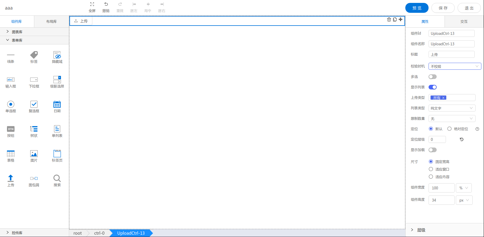

<h2>上传</h2>

---

**1\. 基本信息**



#### **组件简介**

> 名称：上传
>
> 功能：用于文件上传
>
> 使用场景：

#### **属性配置**

| 属性    | 描述信息         | 类型   | 默认值 | 设值方法                   | 取值方法   |
| :------ | :--------------- | :----- | ------ | -------------------------- | ---------- |
| 组件 ID | 控件 ID 自动生成 | string |        |                       |            |
| 组件名称    | 表单标识ID, 联动组件列表显示的名称       | string |  | setFormItemId | getFormItemId |
| 标题 | 上传按钮上的标题 | string | 上传 | setLabelContent | getLabelContent |
| 校验时机 | 表单校验的时机 | string | 不校验 | | |
| 多选 | 是否可以多选上传 | boolean | false | setMultiple | getMultiple |
| 显示列表 | 是否显示以上传文件列表 | boolean | true | setShowList | getShowList | 
| 上传类型 | 可选的上传文件类型, 所有、图片、文件、影音 | array | 所有(*) | setAcceptType | getAcceptType |
| 列表类型 | 已上传文件列表的显示类型, 纯文字、图片、图片-卡片 | string | 纯文字(text) | setListType | getListType |
| 限制数量 | 限制上传文件数量 | number | 无(-1) | setLimitNum | getLimitNum |

#### **示例代码**

```javascript
  // 获取Id为UploadCtrl-1的元素
  var uploadCtrl = window.supQuery.getInstanceById('UploadCtrl-1'); 

  // 组件名称
  uploadCtrl.setFormItemId('UploadCtrl-1');
  const ctrlName = uploadCtrl.getFormItemId();

  // 标题
  uploadCtrl.setLabelContent('');
  const labelContent = uploadCtrl.getLabelContent();

  // 多选
  uploadCtrl.setMultiple(true);
  const isMultiple = uploadCtrl.getMultiple();

  // 显示列表
  uploadCtrl.setShowList(true);
  const showList = uploadCtrl.getShowList();

  // 上传类型
  uploadCtrl.setAcceptType(['*', 'image/*']);
  const acceptTypeList = uploadCtrl.getAcceptType();

  // 列表类型
  uploadCtrl.setListType('picture');
  const listType = uploadCtrl.getListType();

   // 列表类型
  uploadCtrl.setLimitNum(10);
  const limitNum = uploadCtrl.getLimitNum();
```
