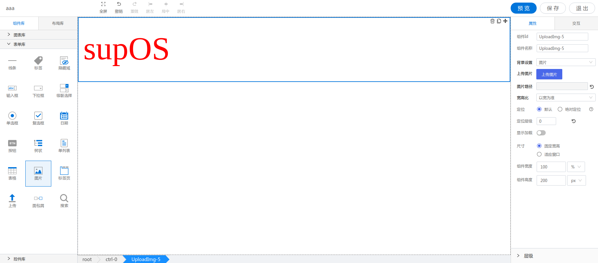

<h2>图片</h2>

---

**1\. 基本信息**



#### **组件简介**

> 名称：图片
>
> 功能：用于显示图片
>
> 使用场景：

#### **属性配置**

| 属性    | 描述信息         | 类型   | 默认值 | 设值方法                   | 取值方法   |
| :------ | :--------------- | :----- | ------ | -------------------------- | ---------- |
| 组件 ID | 控件 ID 自动生成 | string |        |                       |            |
| 组件名称    | 表单标识ID, 联动组件列表显示的名称       | string |  | setFormItemId | getFormItemId |
| 背景设置 | 可选图片、纯色 | object | 图片(picture) | setTypeResult | getTypeResult |
| 上传图片 | 图片模式下, 上传图片资源并显示 |
| 图片路径 | 图片模式下, 上传的图片资源的路径 | string | 
| 宽高比 | 图片模式下, 图片的自适应模式 | string | 不缩放(default) | setTypeResult | getTypeResult | 
| 选择颜色 | 纯色模式下, 选择颜色 | string | #ffffff | setBackground | |

#### **联动配置**
| 类型     | 方法       | 返回数据(作为源)/ 方法赋值（作为目标）| 编辑格式（作为源-返回的数据处理）| 描述 |
| -------- | -------- | ------------------ | ---------------- | ---- |
| 作为源	|
| 作为目标 | 设置图片 |	设置图片url值 |	无 | 设置图片的url值, 并改变背景类型为图片 |
| 作为目标 | 设置背景颜色 |	设置背景颜色值 |	无 | 设置背景颜色的值, 并改变背景类型为纯色 |


#### **示例代码**

```javascript
  // 获取Id为UploadImg-1的元素
  var uploadImgCtrl = window.supQuery.getInstanceById('UploadImg-1'); 

  // 组件名称
  uploadImgCtrl.setFormItemId('UploadImg-1');
  const ctrlName = uploadImgCtrl.getFormItemId();

  // 背景设置
  uploadImgCtrl.setTypeResult({
      type: 'picture', // 背景类型,  picture  pureColor
      imgPath: '',  // 图片地址
      ratio: '',  // 图片自适应模式
      color: ''   // 纯色模式背景颜色
   });
  const type = uploadImgCtrl.getTypeResult();

  // 设置图片
  uploadImgCtrl.setImg('');
  
  // 设置背景颜色
  uploadImgCtrl.setBackground('');

  // 设置值(类型为图片时就是设置图片地址, 纯色时就是设置背景色)
  uploadImgCtrl.setValue('');
  const value = uploadImgCtrl.getValue();

```
