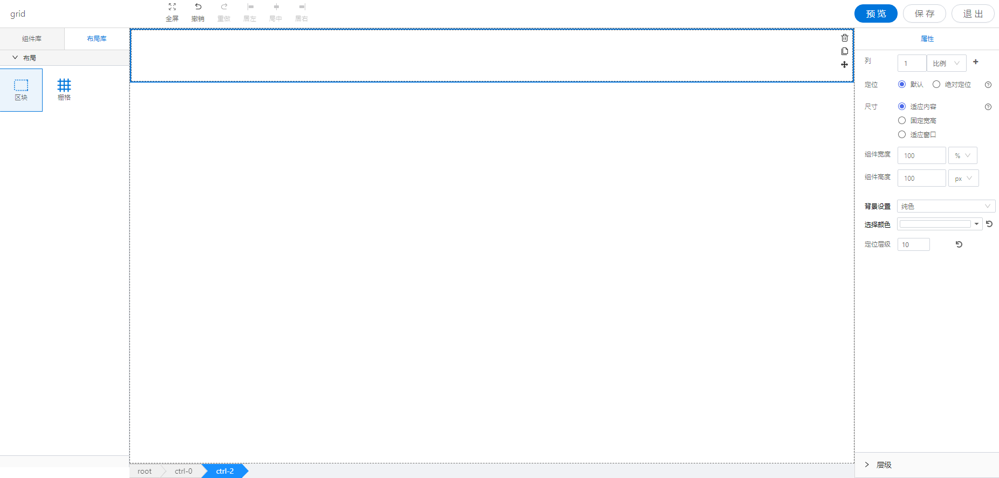

<h2></h2>

---

**1\. 基本信息**

{.img-fluid tag=1}

#### **组件简介**

> 名称：区块
>
> 功能：用于整体页面布局，可以进行分列，嵌套组件和区块本身
>
> 使用场景：所有页面设计，需要布局的页面

#### **属性配置**

| 属性     | 描述信息                 | 类型   | 默认值   | 设值方法             | 取值方法       |
| :------- | :----------------------- | :----- | -------- | -------------------- | -------------- |
| 设置列   | 控制区块列的数量         | Object |          | setGridcol(Object)   | getGridcol()   |
| 定位     | 设置定位模式             | string | relative | setPosition(string)  | getPosition()  |
| 尺寸     | 设置区块的尺寸类型和宽高 | Object |          | setSizeType(Object)  | getSizeType()  |
| 设置图片 | 表格的标题               | string |          | setImgUpload(Object) | getImgUpload() |
| 定位层级 | 设置区块的 z-index 属性  | number | 0        | setZIndex(number)    | getZIndex()    |

#### **示例代码**

设置尺寸

```javascript
instance.setSizeType({
  ...this.getConfig(), // 已有属性
  sizeType: "min", // 尺寸类型 适应内容：min. 固定宽度： stable, 适应窗口 auto
  style: {
    ...this.getConfig().style, // 已有样式
    width: "100%", // 宽度
    height: "100px", // 高度
  },
});
```

设置图片

```javascript
instance.setImgUpload({
  color: "", // 背景颜色 #000000
  type: "pureColor", // 纯色： pureColor 图片：picture
  imgPath: "", // 图片路径
  ratio: "default", // 背景图片类型 不缩放：default, 以宽为准：width, 以高为准：height, 铺满：auto
});
```
