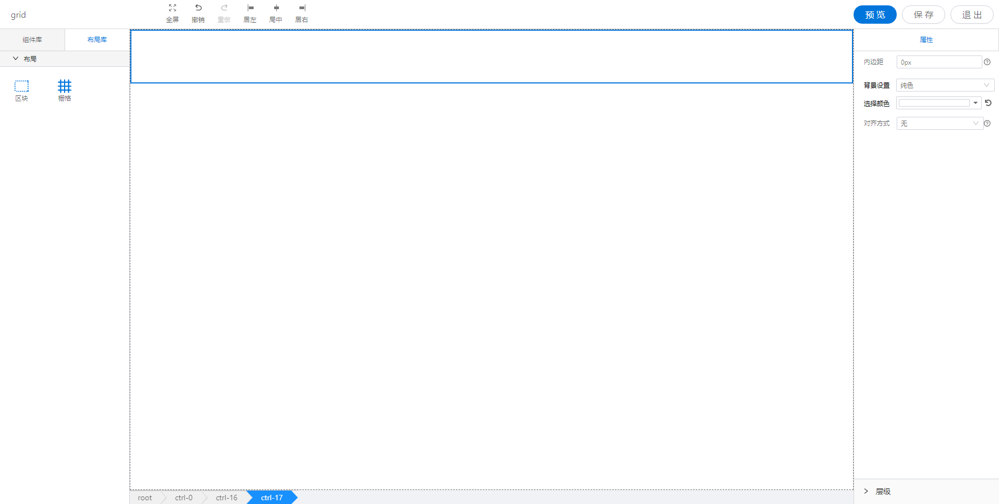

<h2></h2>

---

**1\. 基本信息**

{.img-fluid tag=1}

#### **组件简介**

> 名称：列
>
> 功能：区块的一级子元素，分列之后会有多个列
>
> 使用场景： 对单个区块的的列进行单独配置内边距和背景

#### **属性配置**

| 属性     | 描述信息             | 类型   | 默认值 | 设值方法                 | 取值方法           |
| :------- | :------------------- | :----- | ------ | ------------------------ | ------------------ |
| 内边距   | 设置内边距           | String | 0px    | getIframePadding(String) | getIframePadding() |
| 背景     | 设置列的背景         | Object |        | setImgUpload(Object)     | getImgUpload()     |
| 对齐方式 | 设置区块内的对齐方式 | String |        | setAlign(String)         | getAlign()         |

#### **示例代码**

```javascript
// 设置对齐方式
instance.setAlign("left"); // 居左: 'left' 居右：'right' 居中: 'center'， 无: 'null'
// 设置背景
instance.setImgUpload({
  color: "", // 背景颜色 #000000
  type: "pureColor", // 纯色： pureColor 图片：picture
  imgPath: "", // 图片路径
  ratio: "default", // 背景图片类型 不缩放：default, 以宽为准：width, 以高为准：height, 铺满：auto
});
```
