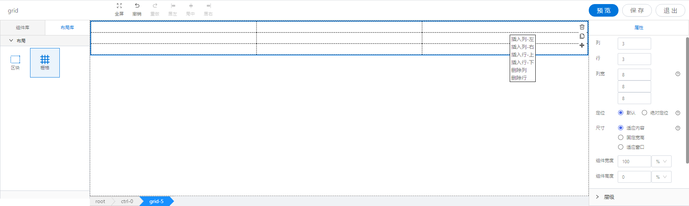

<h2></h2>

---

**1\. 基本信息**

{.img-fluid tag=1}

#### **组件简介**

> 名称：栅格
>
> 功能：可设置行列的布局组件
>
> 使用场景：用于表单提交页面快速布局

#### **属性配置**

| 属性     | 描述信息                 | 类型   | 默认值   | 设值方法             | 取值方法       |
| :------- | :----------------------- | :----- | -------- | -------------------- | -------------- |
| 设置列   | 设置栅格组件有几列       | number | 3        | setCol(number)       | getCol()       |
| 设置行   | 设置栅格组件有几行       | number | 3        | setRow(string)       | getRow()       |
| 列宽     | 设置区块的尺寸类型和宽高 | Array  |          | setColWidth(Array)   | getColWidth()  |
| 定位     | 设置定位模式             | string | relative | setPosition(string)  | getPosition()  |
| 尺寸     | 设置区块的尺寸类型和宽高 | Object |          | setSizeType(Object)  | getSizeType()  |
| 设置图片 | 表格的标题               | string |          | setImgUpload(Object) | getImgUpload() |
| 定位层级 | 设置区块的z-index属性    | number | 0        | setZIndex(number)    | getZIndex()    |

#### **示例代码**

**设置列宽**

```javascript
  instance.setColWidth([2,2,2]) // 总数是24 三列的宽度为总宽度的1/12
```

**设置尺寸**

```javascript
  instance.setSizeType({
    ...this.getConfig(), // 已有属性
    sizeType: 'min', // 尺寸类型 适应内容：min. 固定宽度： stable, 适应窗口 auto
    style: {
      ...this.getConfig().style, // 已有样式
      width: '100%', // 宽度
      height: '100px', // 高度
    }
  })

```

**设置图片**

```javascript
  instance.setImgUpload({
    color: '', // 背景颜色 #000000
    type: 'pureColor', // 纯色： pureColor 图片：picture
    imgPath: '', // 图片路径
    ratio: 'default'// 背景图片类型 不缩放：default, 以宽为准：width, 以高为准：height, 铺满：auto
  })

```
