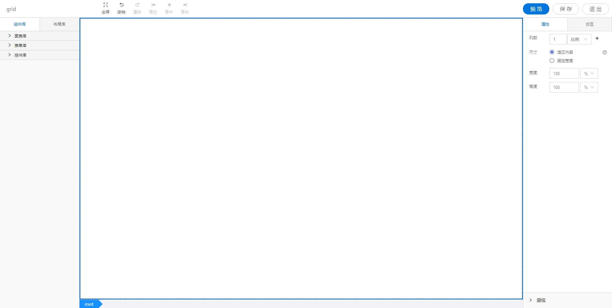

<h2></h2>

---

**1\. 基本信息**

{.img-fluid tag=1}

#### **组件简介**

> 名称：页面
>
> 功能：网格布局根组件
>
> 使用场景：所有页面设计，需要布局的页面

#### **属性配置**

| 属性   | 描述信息           | 类型   | 默认值 | 设值方法           | 取值方法     |
| :----- | :----------------- | :----- | ------ | ------------------ | ------------ |
| 设置列 | 控制页面列的数量   | Object |        | setGridcol(Object) | getGridcol() |
| 尺寸   | 设置页面的尺寸类型 | String | 'min'  | setSize(String)    | getSize()    |
| 宽度   | 设置页面的宽度     | String | 100%   | setWidth(Object)   | getWidth()   |
| 高度   | 设置页面的高度     | String | 100%   | setHeight(Object)  | geiHeight()  |
