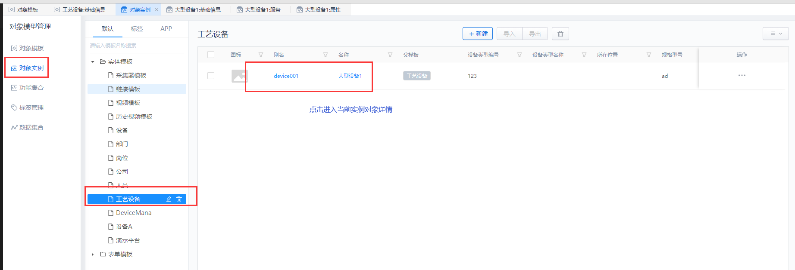

## **内置对象服务**

### **服务说明**

* [setPropertyValue 设置属性值服务](/docs/ObjectService/Service/EntityTemplate/setPropertyValue)
* [setPropertyValues 设置属性值服务](/docs/ObjectService/Service/EntityTemplate/setPropertyValues)
* [setPropertyDefaultValue 设置默认值](/docs/ObjectService/Service/EntityTemplate/setPropertyDefaultValue)
* [getPropertyValue 获取属性值服务](/docs/ObjectService/Service/EntityTemplate/getPropertyValue)
* [getPropertyValues 获取多个属性值服务](/docs/ObjectService/Service/EntityTemplate/getPropertyValues)
* [getPropertyVQTValue 获取属值服务,以VQT模式返回](/docs/ObjectService/Service/EntityTemplate/getPropertyVQTValue)
* [getPropertyVQTValues 获取多个属性值服务](/docs/ObjectService/Service/EntityTemplate/getPropertyVQTValues)
* [getPropertiesHistory 获取属性历史值服务](/docs/ObjectService/Service/EntityTemplate/getPropertiesHistory)
* [getCertainHistory 根据给定时刻和处理策略获取最近一条历史值服务](/docs/ObjectService/Service/EntityTemplate/getCertainHistory)

|别名|名称|命名空间|描述|输入|输出|
|:---|:---|:------|:---|:---|:---|
|setPropertyValue|设置属性值服务|system|设置属性值服务|propName,propValue||
|setPropertyValues|设置属性值服务|system|设置属性值服务|propValues 参数格式：{"propNamsapace.propEnName1":"11","propNamsapace.propEnName2":"zhangsan"}||
|setPropertyDefaultValue|设置默认值|system|设置默认值|propName,propValue||
|getPropertyValue|获取属性值服务|system|获取属性值服务|propName|result|
|getPropertyValues|获取多个属性值服务|system|获取多个属性值服务|propNames|result|
|getPropertyVQTValue|获取属值服务,以VQT模式返回|system|获取属值服务,以VQT模式返回|propName|result|
|getPropertyVQTValues|获取多个属性值服务|system|获取多个属性值服务|propNames||
|getPropertiesHistory|获取属性历史值服务|system|获取属性历史值服务|inputs 参数格式：{"fill":{"strategy":"previous"},"groupBy":{"time":"300s"},"limit":5,"offset":0,"select":["first(\"vendor1.chxBind4.chxBind4_o4.vendor1.p8\")"],"where":{"and":{"timestamp":{"ge":"","gt":"2020-05-26T05:30:00Z","le":"","lt":"2020-05-26T06:15:01Z"}}}}|result|
|getCertainHistory|根据给定时刻和处理策略获取最近一条历史值服务|system|根据给定时刻和处理策略获取最近一条历史值服务|inputs 参数格式：{"propNames":["propNamsapace.propEnName1","propNamsapace.propEnName2"],"time":"2020-03-11T12:00:00Z","strategy": "pre/next"}|result|

### **可执行语法**

> 术语解析
>
> 「namespace」 命名空间
>
> 「template_alias」模板别名
> 
> 「instance_alias」实例记录别名

#### **获取实例**

> 方式一：var instance = templates["namespace.template_alias"].instances("instance_alias") ;
> 
> 方式二：var instance = ObjectPool.get("instance_alias");

#### **获取实例下属性快照值**

- **方式一**
  
> var instance = templates["namespace.template_alias"].instances("instance_alias") ;
> 
> var propValue = instance.getPropertyValue("namespace.property_alias"); // namespace可以不传，但是如果存在同名属性会报错

- **方式二**
  
> var instance = templates["namespace.template_alias"].instances("instance_alias") ;
> 
> var propValue = instance.property;

- **方式三**
  
> var instance = templates["namespace.template_alias"].instances("instance_alias") ;
> 
> var propValue = instance1.executeService("getPropertyValue", {"propName":"namespace.property_alias"}); // namespace可以不传，但是如果存在同名属性会报错

#### **设置属性值**

- **方式一**
  
> var instance = templates["namespace.template_alias"].instances("instance_alias") ;
> 
> instance.getPropertyValue("namespace.property_alias"); // namespace可以不传，但是如果存在同名属性会报错

- **方式二**
  
> var instance = templates["namespace.template_alias"].instances("instance_alias") ;
> 
> instance.executeService("setPropertyValue", {"propName":"namespace.property_alias", "propValue":"123"}); // namespace可以不传，但是如果存在同名属性会报错

#### **触发事件**

> var instance = templates["namespace.template_alias"].instances("instance_alias") ;
> 
> instance.fireEvent("event", param);

#### **执行服务(只能执行实体模板下的实例服务)**

> var instance = templates["namespace.template_alias"].instances("instance_alias") ;
> 
> var result = instance.executeService("namespace.service_alias", param); // namespace可以不传，但是如果存在同名服务会报错

### **在脚本中快捷调用系统内置服务**

> var param = {};    //定义参数
>
> var result = me.setPropertyValue(param);    //调用setPropertyValue服务
>
> var result = me.setPropertyDefaultValue(param);    //调用setPropertyDefaultValue服务
>
> var result = me.setPropertyValues(param);    //调用setPropertyValues服务
>
> var result = me.getPropertyValue(param);    //调用getPropertyValue服务
>
> var result = me.getPropertyVQTValue(param);    //调用getPropertyVQTValue服务
>
> var result = me.getPropertiesHistory(param);    //调用getPropertiesHistory服务
>
> var result = me.getCertainHistory(param);    //调用getCertainHistory服务
>
> var result = me.getPropertyValues(param);    //调用getPropertyValues服务
>
> var result = me.getPropertyVQTValues(param);    //调用getPropertyVQTValues服务

### **调试入口**

点击【对象实例 - 实体模板 - 具体某个实例】进入详情页面，点击【服务】标签，可以针对当前实例记录进行调试。

{.img-fluid tag=1}