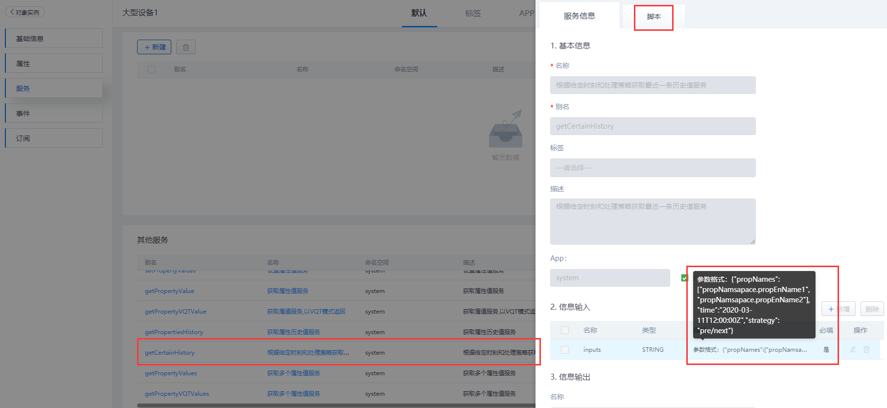
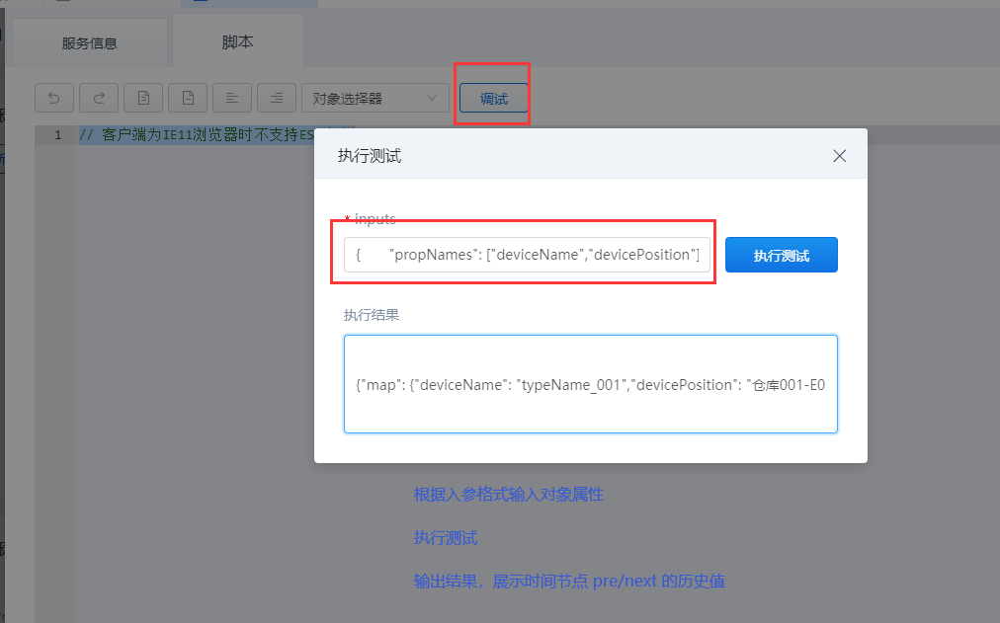

## **getCertainHistory**

### **功能**

对象实例下的实体模板中，查询某个对象实例中在某个时间点的属性值。

- **处理策略**
  - 「**pre**」-- 该时间点没值取上一个时间值；
  - 「**next**」-- 该时间点没值取下一个时间点值；

### **示例**

在实体模板对象「liye_fdms.DeviceTemplate」中查询实例对象「device001」的属性值。

{.img-fluid tag=1}

{.img-fluid tag=1}

### **入参格式**

```JSON
{
	"propNames": ["deviceName","devicePosition"],
	"time": "2020-11-05T16:08:41Z",
	"strategy": "next"
}
```

### **输出结果**

```JSON
{
	"map": {
		"deviceName": "typeName_001",
		"devicePosition": "仓库001-E03"
	}
}
```

### **自定义服务调用**

```JS
//获取实例对象
var instance = ObjectPool.get("device001"); //实例对象别名

//入参
var time = '2020-11-05T16:08:41Z';//时间节点
var pros = ["deviceName","devicePosition"];//属性别名的集合
var params = {
    "propNames": pros,
    "time": time,
    "strategy": "pre" //处理策略(pre:该时间点没值取上一个时间值;next:该时间点没值取下一个时间点值)
};
var inputs = {
    inputs: JSON.stringify(params)
};
//输出结果
var result = instance.executeService('getCertainHistory',inputs);
result;
```