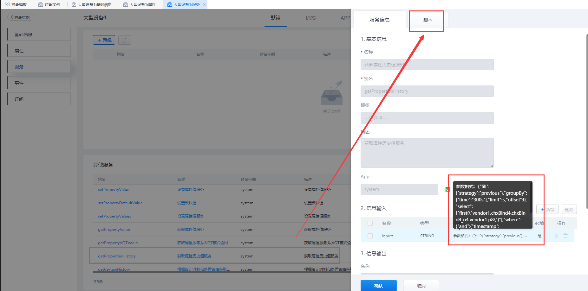

## **getPropertiesHistory**

### **功能**

对象实例下的实体模板中，查询某个对象实例中多个属性的历史值。

### **示例**

在实体模板对象「liye_fdms.DeviceTemplate」中查询实例对象「device001」的属性值。

{.img-fluid tag=1}

### **入参格式**

#### **参数解析**
  
|key|value|type|description|
|---|---|---|---|
|select|["function(\\"对象别名.属性别名\\")"] or ["\\"对象别名.属性别名\\""]|字符串数组|查询的对象属性及聚合方法(mean,sum,max,min)|
|where|{"and":{}}|Object|过滤条件，暂时只支持and|
|> and|{"timestamp":{}}|Object|过滤条件，暂时只支持timestamp|
|>> timestamp|{"ge":"2018-08-01T00:00:00Z,"le":"2018-08-02T00:00:00Z""}|Object|时间范围，支持ge,gt,lt,le|
|groupBy|{"time":""}|Object|分组条件,只支持time|
|> time|"1s,1s"|String|统计粒度，支持s,m,h,d,w,M 逗号前为统计粒度，逗号后为分组偏移量|
|fill|{"strategy":""}|Object|补值策略,只支持previous|
|> strategy|"previous"|String|如果当前分组没有数据向前一分组取值|
|offset|正整数|Integer|取值偏移量|
|limit|正整数|Integer|取值条数|

#### **参数示例**

```JSON
{
    "fill": {
        "strategy": "previous"
    },
    "groupBy": {
        "time": "300s"
    },
    "limit": 5,
    "offset": 0,
    "select": ["first(\"vendor1.chxBind4.chxBind4_o4.vendor1.p8\")"],
    "where": {
        "and": {
            "timestamp": {
                "ge": "",
                "gt": "2020-05-26T05:30:00Z",
                "le": "",
                "lt": "2020-05-26T06:15:01Z"
            }
        }
    }
}
```

### **输出结果**

#### **参数解析**

|key|value|type|description|
|---|---|---|---|
|name|对象别名.属性别名|字符串|查询的对象属性|
|function|聚合方法|字符串|聚合方法(mean,sum,max,min)|
|fields|["time","value"]|字符串数组|返回的字段，如time,value|
|datas|[["2018-10-11T06:51:17Z",1],["2018-10-11T06:51:18Z",1]]|二维数组|分组后的值|

```JSON
{
    "results": [{
        "name": "对象别名.属性别名",
        "function": "聚合方法",
        "fields": ["time", "value"],
        "datas": [
            ["2018-10-11T06:51:17Z", 1],
            ["2018-10-11T06:51:18Z", 1]
        ]
    }]
}
```

### **自定义服务调用**

```JS
//获取实例对象
var instance = ObjectPool.get("device001"); //实例对象别名

//入参
var inputs = {
    select: "Pump001.*"
    ......
}

//输出结果
var result = instance.executeService('getPropertiesHistory',inputs);
result;
```