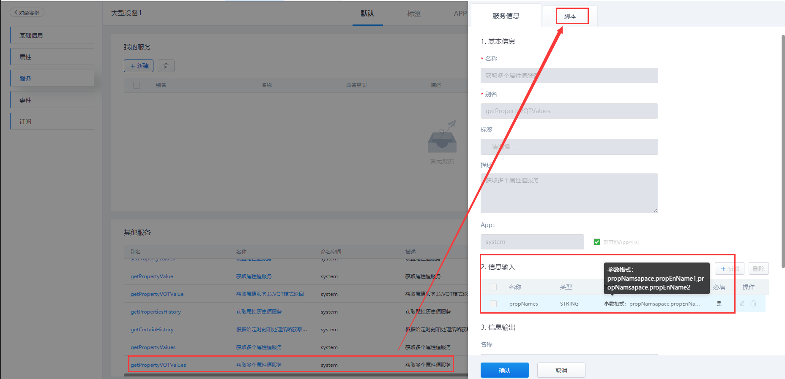
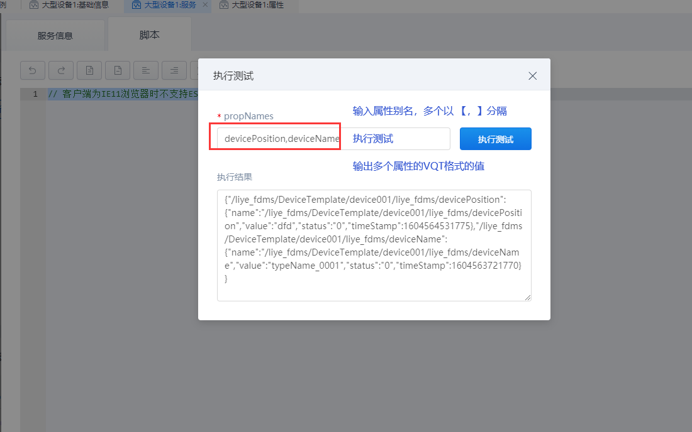

## **getPropertyVQTValues**

### **功能**

对象实例下的实体模板中，查询某个对象实例中的多个属性的VQT值。

- **VQT**解析：
  - Value(属性值);
  - Quality(状态码);
  - Time(时间戳);

### **示例**

在实体模板对象「liye_fdms.DeviceTemplate」中查询实例对象「device001」的属性的VQT值。

{.img-fluid tag=1}

{.img-fluid tag=1}


### **返回值**

```JSON
{
	"/liye_fdms/DeviceTemplate/device001/liye_fdms/devicePosition": {
		"name": "/liye_fdms/DeviceTemplate/device001/liye_fdms/devicePosition",
		"value": "dfd",
		"status": "0",
		"timeStamp": 1604564531775
	},
	"/liye_fdms/DeviceTemplate/device001/liye_fdms/deviceName": {
		"name": "/liye_fdms/DeviceTemplate/device001/liye_fdms/deviceName",
		"value": "typeName_0001",
		"status": "0",
		"timeStamp": 1604563721770
	}
}
```

### **自定义服务调用**

```JS
//获取实例对象
var instance = ObjectPool.get("device001"); //实例对象别名

//入参
var inputs = {
    propName:'devicePosition,deviceName', //proName:多个属性别名拼成字符串，以’，’符号分隔开
};
//输出结果
var result = instance.executeService('getPropertyVQTValues',inputs);
result;
```