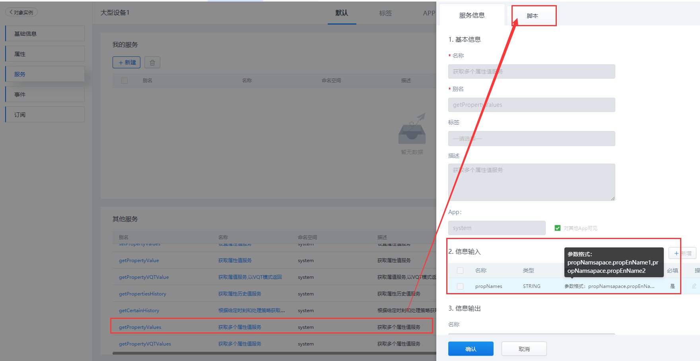
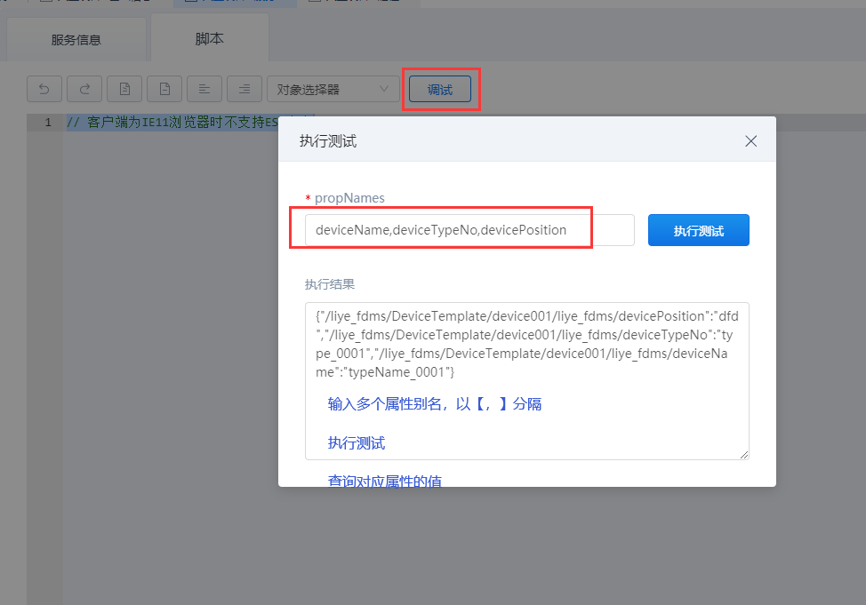

## **getPropertyValues**

### **功能**

对象实例下的实体模板中，查询某个对象实例中的多个属性的值。

### **示例**

在实体模板对象「liye_fdms.DeviceTemplate」中查询实例对象「device001」的属性值。

{.img-fluid tag=1}

{.img-fluid tag=1}

### **输出结果**

```JSON
{
	"/liye_fdms/DeviceTemplate/device001/liye_fdms/devicePosition": "dfd",
	"/liye_fdms/DeviceTemplate/device001/liye_fdms/deviceTypeNo": "type_0001",
	"/liye_fdms/DeviceTemplate/device001/liye_fdms/deviceName": "typeName_0001"
}
```

### **自定义服务调用**

```JS
//获取实例对象
var instance = ObjectPool.get("device001"); //实例对象别名

//入参
var inputs = {
    propName:'devicePosition,deviceTypeNo,deviceName', //proName:属性别名,多个属性别名拼成字符串，以’，’符号分隔开
};
//输出结果
var result = instance.executeService('getPropertyValues',inputs);
result;
```