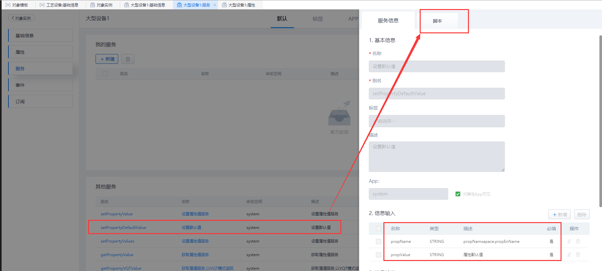
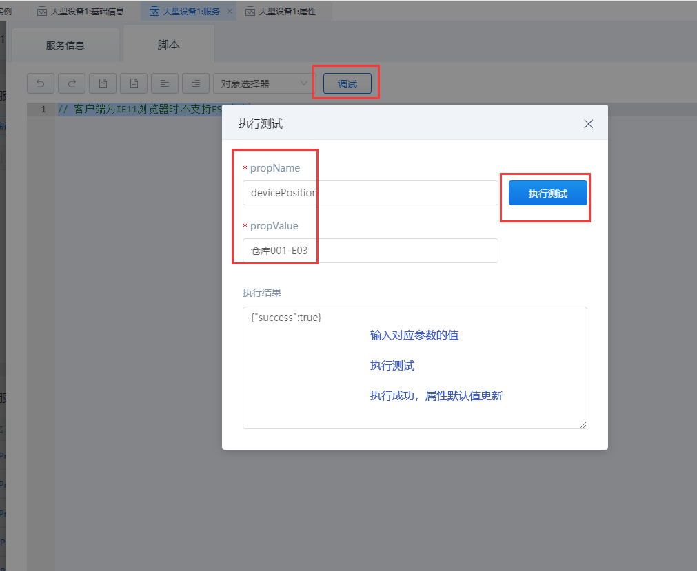
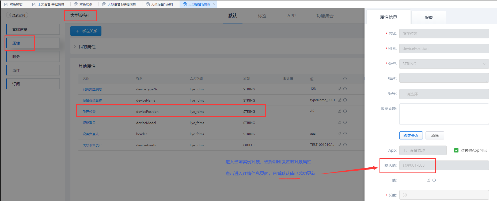

## **setPropertyDefaultValue**

### **功能**

对象实例下的实体模板中，对某个对象实例中的单个属性进行默认赋值；

因为在当前属性为「**只读**」情况下。使用「setPropertyValue」无法实现写入操作。


### **示例**

在实体模板对象「liye_fdms.DeviceTemplate」中设置实例对象「device001」设置其属性默认值。

{.img-fluid tag=1}

{.img-fluid tag=1}

{.img-fluid tag=1}

### **自定义服务调用**

```JS
//获取实例对象
var instance = ObjectPool.get("device001"); //实例对象别名

//入参
var inputs = {
    propName:'devicePosition', //proName:属性别名
    propValue:'仓库001-E03' //propValue:写入属性默认值
};
//输出结果
var result = instance.executeService('setPropertyDefaultValue',inputs);
result;
```