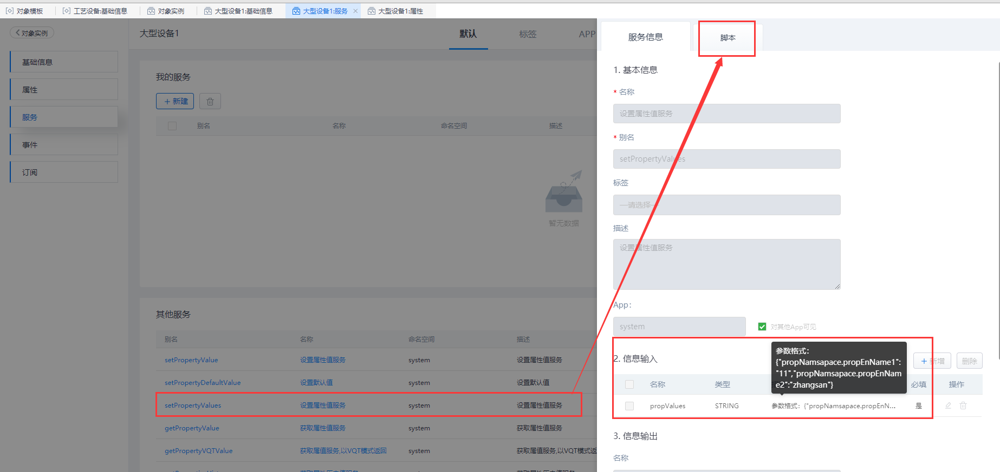
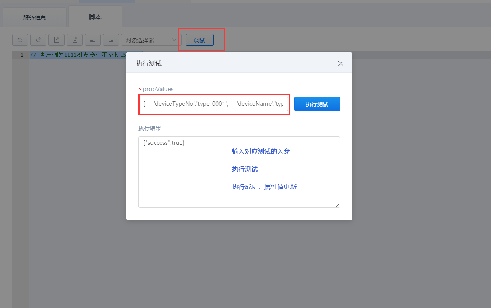
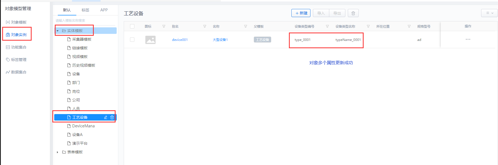

## **setPropertyValues**

### **功能**

对象实例下的实体模板中，对某个对象实例中的多个属性进行赋值。

### **示例**

在实体模板对象「liye_fdms.DeviceTemplate」中设置实例对象「device001」设置其属性值。

{.img-fluid tag=1}

{.img-fluid tag=1}

{.img-fluid tag=1}

### **自定义服务调用**

```JS
//获取实例对象
var instance = ObjectPool.get("device001"); //实例对象别名

//入参
var prop = {
    'deviceTypeNo':'type_0001',//属性别名:属性写入值
    'deviceName':'typeName_0001'
}
var inputs = {
    propValues:JSON.stringify(prop) //String
};
//输出结果
var result = instance.executeService('setPropertyValues',inputs);
result;
```