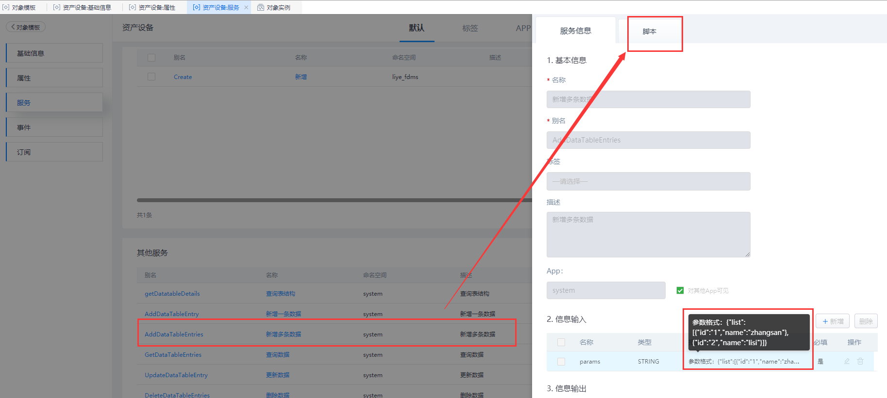

## **AddDataTableEntries**

### **功能**

针对当前的表单模板，批量插入业务数据。

### **示例**

在 表单模板对象 「liye_fdms.DeviceAssets」 中批量插入多条数据。

{.img-fluid tag=1}

{.img-fluid tag=1}

{.img-fluid tag=1}

### **输入参数示例**

```JSON
{
	"list": [{
		"afterSalesContact": "77777777",
		"deviceBrand": "Brand_002",
		"deviceCode": "NO_002",
		"deviceName": "Name_002",
		"deviceStatus": "2",
		"financialNumber": "CWNo_002",
		"manufacturer": "CJ_002",
		"productionTime": "2020-11-06 11:27:51",
		"purchaseDate": "2020-11-05",
		"purchasePrice": "200",
		"specModel": "GuiGe_002"
	}, {
		"afterSalesContact": "99999999",
		"deviceBrand": "Brand_003",
		"deviceCode": "NO_003",
		"deviceName": "Name_003",
		"deviceStatus": "3",
		"financialNumber": "CWNo_003",
		"manufacturer": "CJ_003",
		"productionTime": "2020-11-06 11:27:51",
		"purchaseDate": "2020-11-05",
		"purchasePrice": "300",
		"specModel": "GuiGe_003"
	}]
}
```

### **返回值**

输出结果为「布尔类型」 ，输出「执行成功」。
