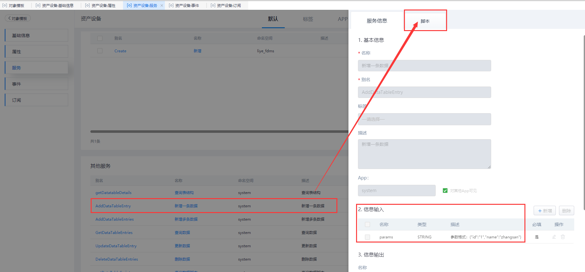

## **AddDataTableEntry**

### **功能**

针对当前的表单模板，新增一条数据。

### **示例**

在 表单模板对象 「liye_fdms.DeviceAssets」 中新增一条数据。

{.img-fluid tag=1}

{.img-fluid tag=1}

{.img-fluid tag=1}

### **输入参数示例**

```JSON
{
	"afterSalesContact": "88888888",
	"deviceBrand": "Brand_001",
	"deviceCode": "NO_001",
	"deviceName": "Name_001",
	"deviceStatus": "1",
	"financialNumber": "CWNo_001",
	"manufacturer": "CJ_001",
	"productionTime": "2020-11-06 11:27:51",
	"purchaseDate": "2020-11-05",
	"purchasePrice": "100",
	"specModel": "GuiGe_001"
}
```

### **返回值**

输出结果为「布尔类型」 ，输出「执行成功」。