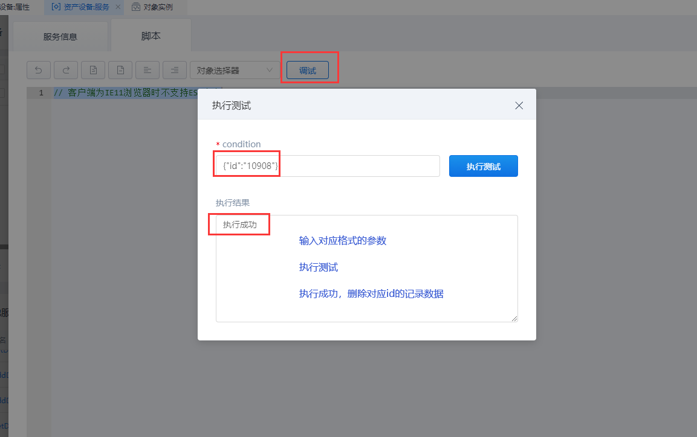

## **DeleteDataTableEntries**

### **功能**

针对当前的表单模板，根据筛选条件删除数据。

### **示例**

在 表单模板对象 「liye_fdms.DeviceAssets」 中删除数据。

{.img-fluid tag=1}

{.img-fluid tag=1}

{.img-fluid tag=1}

### **输入参数示例**

```JSON
{
	"id": "10908"
}
```

### **返回值**

输出结果为「布尔类型」 ，输出「执行成功」。