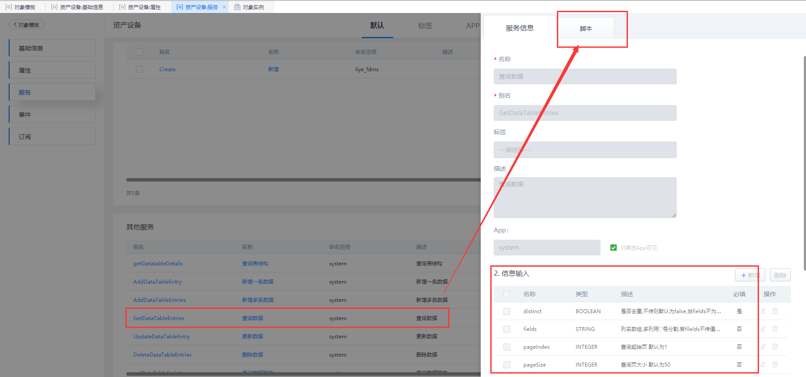
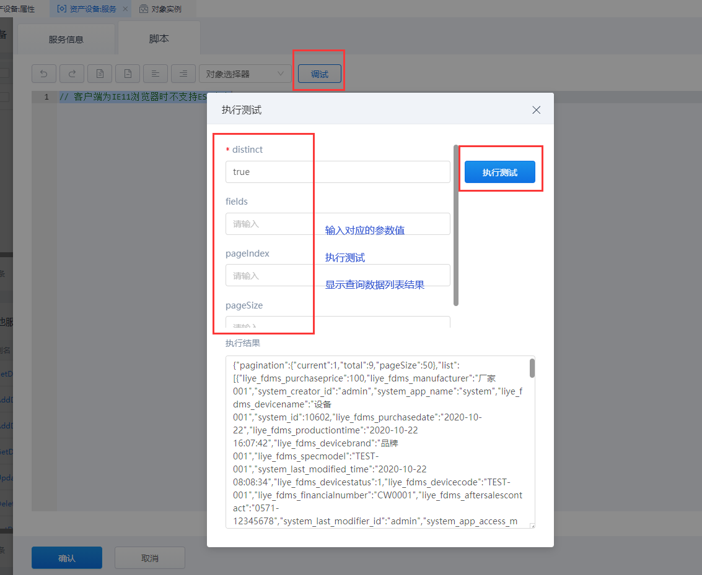

## **GetDataTableEntries**

### **功能**

分页查询 对象模板 的表数据。

### **示例**

分页查询 表单模板对象 「liye_fdms.DeviceAssets」 的所有数据信息。

{.img-fluid tag=1}

{.img-fluid tag=1}

### **输入参数示例**

|名称|类型|描述|必填|
|:---|:---|:------|:---|
|distinct|BOOLEAN|是否去重,不传则默认为false,当fields不为空时有效.|是|
|fields|STRING|列名数组,多列用','号分割.若filelds不传值或为空值则查询全部列.|否|
|pageIndex|INTEGER|查询起始页 默认为1.|否|
|pageSize|INTEGER|查询页大小 默认为50.|否|

### **返回值**

```JSON
{
	"pagination": {
		"current": 1,
		"total": 3,
		"pageSize": 50
	},
	"list": [{
		"liye_fdms_purchaseprice": 100,
		"liye_fdms_manufacturer": "CJ_001",
		"system_creator_id": "admin",
		"system_app_name": "system",
		"liye_fdms_devicename": "Name_001",
		"system_id": 10905,
		"liye_fdms_purchasedate": "2020-11-05",
		"liye_fdms_productiontime": "2020-11-06 11:27:51",
		"liye_fdms_devicebrand": "Brand_001",
		"liye_fdms_specmodel": "GuiGe_001",
		"system_last_modified_time": "2020-11-05 03:28:04",
		"liye_fdms_devicestatus": 1,
		"liye_fdms_devicecode": "NO_001",
		"liye_fdms_financialnumber": "CWNo_001",
		"liye_fdms_aftersalescontact": "88888888",
		"system_last_modifier_id": "admin",
		"system_app_access_mode": "PUBLIC",
		"system_created_time": "2020-11-05 03:28:04"
	}, {
		"liye_fdms_purchaseprice": 200,
		"liye_fdms_manufacturer": "CJ_002",
		"system_creator_id": "admin",
		"system_app_name": "App_cd937d14f138cc4545c4f5939d447c5b",
		"liye_fdms_devicename": "Name_002",
		"system_id": 10907,
		"liye_fdms_purchasedate": "2020-11-05",
		"liye_fdms_productiontime": "2020-11-06 11:27:51",
		"liye_fdms_devicebrand": "Brand_002",
		"liye_fdms_specmodel": "GuiGe_002",
		"system_last_modified_time": "2020-11-05 03:47:27",
		"liye_fdms_devicestatus": 2,
		"liye_fdms_devicecode": "NO_002",
		"liye_fdms_financialnumber": "CWNo_002",
		"liye_fdms_aftersalescontact": "77777777",
		"system_last_modifier_id": "admin",
		"system_app_access_mode": "PUBLIC",
		"system_created_time": "2020-11-05 03:47:27"
	}, {
		"liye_fdms_purchaseprice": 300,
		"liye_fdms_manufacturer": "CJ_003",
		"system_creator_id": "admin",
		"system_app_name": "App_cd937d14f138cc4545c4f5939d447c5b",
		"liye_fdms_devicename": "Name_003",
		"system_id": 10908,
		"liye_fdms_purchasedate": "2020-11-05",
		"liye_fdms_productiontime": "2020-11-06 11:27:51",
		"liye_fdms_devicebrand": "Brand_003",
		"liye_fdms_specmodel": "GuiGe_003",
		"system_last_modified_time": "2020-11-05 03:47:27",
		"liye_fdms_devicestatus": 3,
		"liye_fdms_devicecode": "NO_003",
		"liye_fdms_financialnumber": "CWNo_003",
		"liye_fdms_aftersalescontact": "99999999",
		"system_last_modifier_id": "admin",
		"system_app_access_mode": "PUBLIC",
		"system_created_time": "2020-11-05 03:47:27"
	}]
}
```