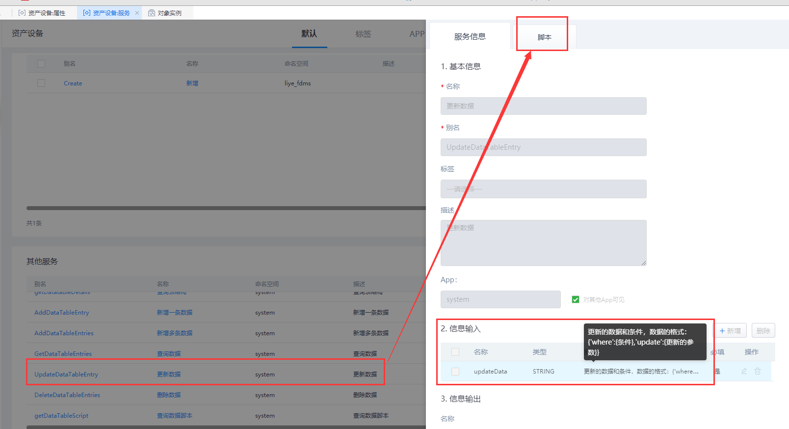
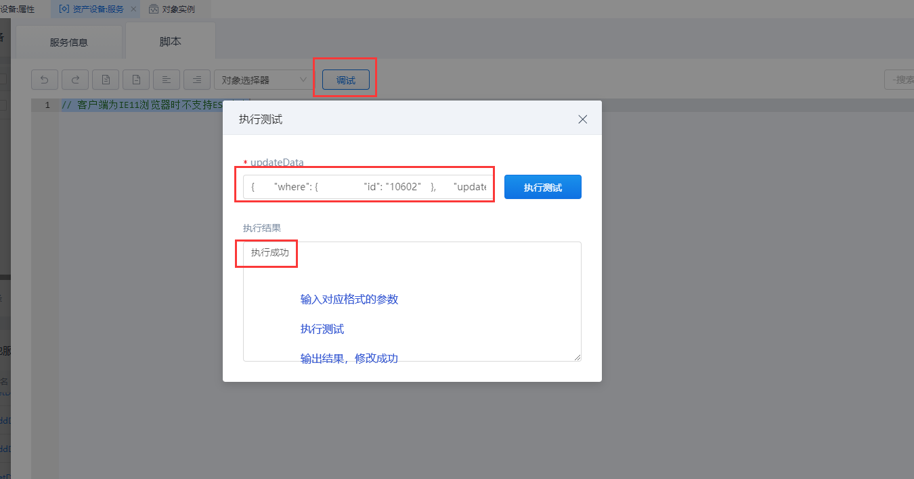
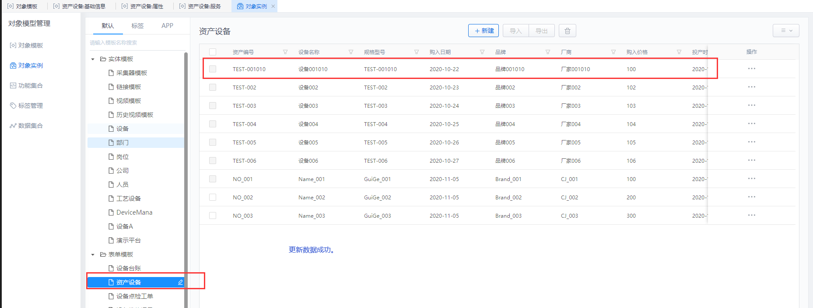

## **UpdateDataTableEntry**

### **功能**

针对当前的表单模板，更新/修改一条数据。

### **示例**

在 表单模板对象 「liye_fdms.DeviceAssets」 中更新/修改一条数据。

{.img-fluid tag=1}

{.img-fluid tag=1}

{.img-fluid tag=1}

### **输入参数示例**

```JSON
{
	"where": {
		"id": "10602"
	},
	"update": {
		"deviceCode": "TEST-001010",
		"deviceName": "设备001010",
		"specModel": "TEST-001010",
		"purchaseDate": "2020-10-22",
		"deviceBrand": "品牌001010",
		"manufacturer": "厂家001010",
		"purchasePrice": 100,
		"productionTime": "2020-10-22 16:07:42",
		"financialNumber": "CW0001010",
		"afterSalesContact": "0571-12345678",
		"deviceStatus": "1"
	}
}
```

### **返回值**

输出结果为「布尔类型」 ，输出「执行成功」。