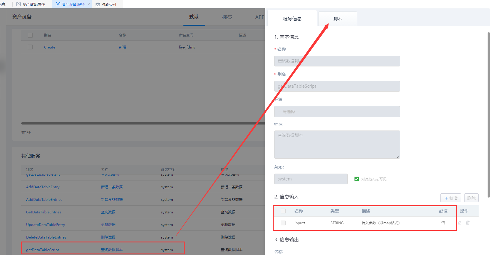
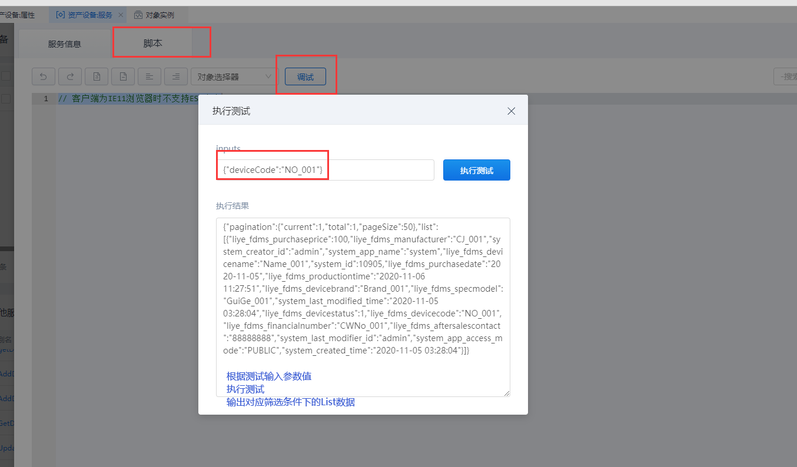

## **getDataTableScript**

### **功能**

针对当前的表单模板，根据筛选条件查询数据。

### **示例**

在 表单模板对象 「liye_fdms.DeviceAssets」 中删除数据。

{.img-fluid tag=1}

{.img-fluid tag=1}

### **输入参数示例**

```JSON
{
	"deviceCode": "NO_001"
}
```

### **返回值**

```JSON
{
	"pagination": {
		"current": 1,
		"total": 1,
		"pageSize": 50
	},
	"list": [{
		"liye_fdms_purchaseprice": 100,
		"liye_fdms_manufacturer": "CJ_001",
		"system_creator_id": "admin",
		"system_app_name": "system",
		"liye_fdms_devicename": "Name_001",
		"system_id": 10905,
		"liye_fdms_purchasedate": "2020-11-05",
		"liye_fdms_productiontime": "2020-11-06 11:27:51",
		"liye_fdms_devicebrand": "Brand_001",
		"liye_fdms_specmodel": "GuiGe_001",
		"system_last_modified_time": "2020-11-05 03:28:04",
		"liye_fdms_devicestatus": 1,
		"liye_fdms_devicecode": "NO_001",
		"liye_fdms_financialnumber": "CWNo_001",
		"liye_fdms_aftersalescontact": "88888888",
		"system_last_modifier_id": "admin",
		"system_app_access_mode": "PUBLIC",
		"system_created_time": "2020-11-05 03:28:04"
	}]
}
```