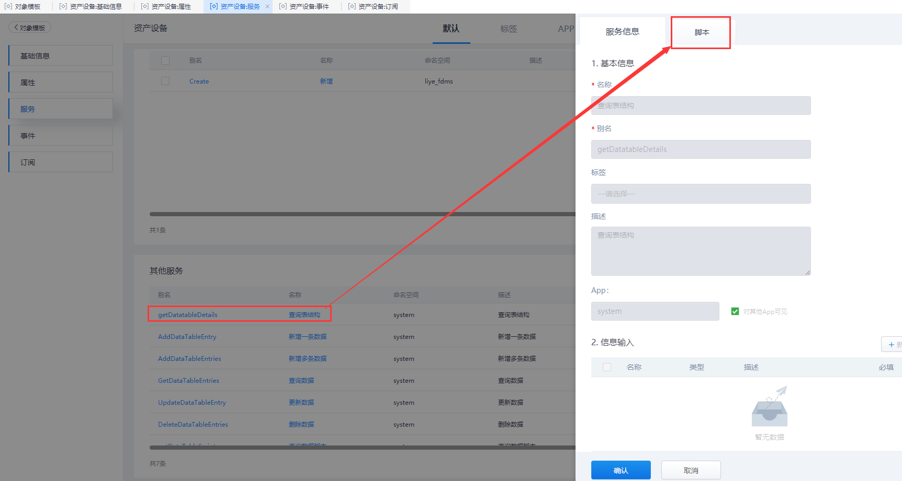
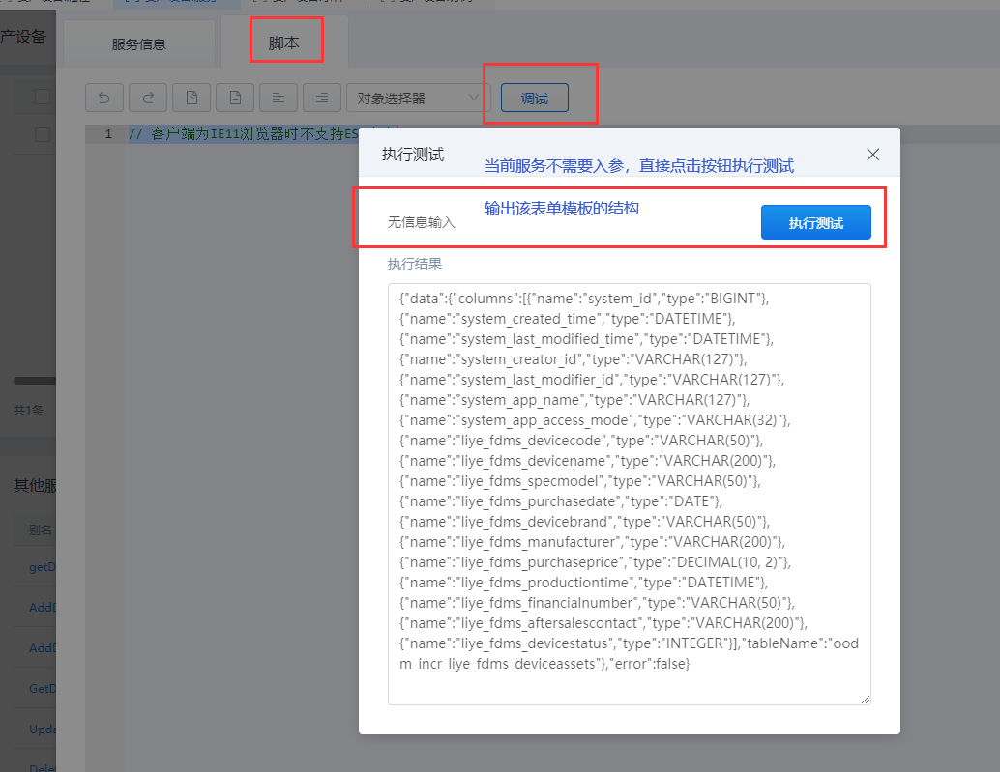

## **getDatatableDetails**

### **功能**

查询 对象模板 的表结构。

### **示例**

查询 表单模板对象 「liye_fdms.DeviceAssets」 的表结构。

{.img-fluid tag=1}

{.img-fluid tag=1}

### **返回值**

```JSON
{
	"data": {
		"columns": [{
			"name": "system_id",
			"type": "BIGINT"
		}, {
			"name": "system_created_time",
			"type": "DATETIME"
		}, {
			"name": "system_last_modified_time",
			"type": "DATETIME"
		}, {
			"name": "system_creator_id",
			"type": "VARCHAR(127)"
		}, {
			"name": "system_last_modifier_id",
			"type": "VARCHAR(127)"
		}, {
			"name": "system_app_name",
			"type": "VARCHAR(127)"
		}, {
			"name": "system_app_access_mode",
			"type": "VARCHAR(32)"
		}, {
			"name": "liye_fdms_devicecode",
			"type": "VARCHAR(50)"
		}, {
			"name": "liye_fdms_devicename",
			"type": "VARCHAR(200)"
		}, {
			"name": "liye_fdms_specmodel",
			"type": "VARCHAR(50)"
		}, {
			"name": "liye_fdms_purchasedate",
			"type": "DATE"
		}, {
			"name": "liye_fdms_devicebrand",
			"type": "VARCHAR(50)"
		}, {
			"name": "liye_fdms_manufacturer",
			"type": "VARCHAR(200)"
		}, {
			"name": "liye_fdms_purchaseprice",
			"type": "DECIMAL(10, 2)"
		}, {
			"name": "liye_fdms_productiontime",
			"type": "DATETIME"
		}, {
			"name": "liye_fdms_financialnumber",
			"type": "VARCHAR(50)"
		}, {
			"name": "liye_fdms_aftersalescontact",
			"type": "VARCHAR(200)"
		}, {
			"name": "liye_fdms_devicestatus",
			"type": "INTEGER"
		}],
		"tableName": "oodm_incr_liye_fdms_deviceassets"
	},
	"error": false
}
```