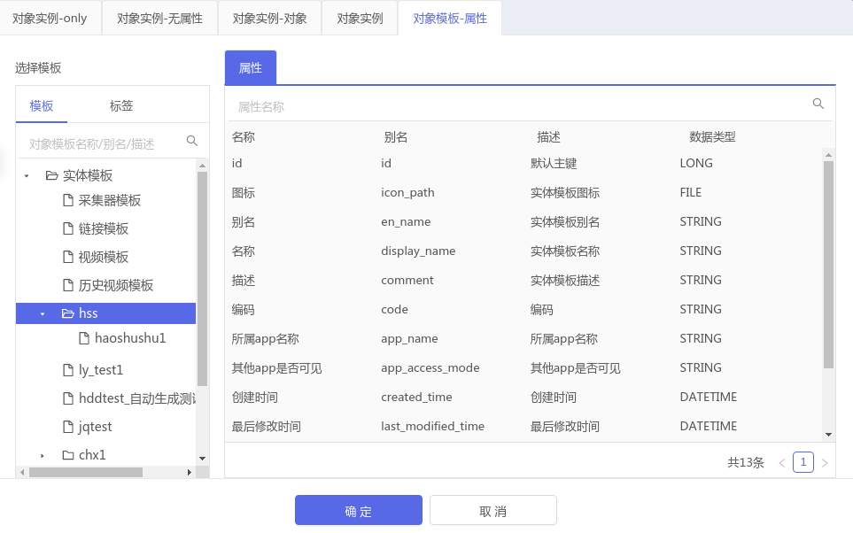

# @supos/object-selector  3.0 以上的版本文档

## 基本使用方式

```jsx
import { ObjectSelectorModal, ObjectSelector } from '@supos/object-selector';

// ...JSX
<ObjectSelectorModal
  tabs={['instance']}
  subTabs={['property']}

  handleOk={this.handleOk}
  handleCancel={this.handleCancel}
  visible={visible}
  domain=""
/>;
```
### ObjectSelectorModal : 自带弹窗

### ObjectSelector： 不带弹窗


## 属性配置

| 属性名 | 描述 | 类型 | 默认值 |
| :---- |:--- |:--- |:---|
| visible | 显隐 | array | 无 |
| tabs | 窗口配置 | array: 'instance'/ 'template' / 'singleList-instance' | 无 |
| subTabs | 窗口配置 | array: 适用所有的Tab ; object： 使用针对tab的单独配置 | 默认 |
| selectedObject | 回填 | Object | 无 |
| handleOk | 点击确认事件 | fn | 默认 |
| handleCancel | 取消事件 | fn | 默认 |
| multiSelect | 对象实例中只有模板和实例 判断是否多选, true: 多选 false: 单选 | boolean | 默认 |
| domain | 域名配置 | string | 默认 |

## tabs/ subTabs 配置

> ### instance

  模板-实例(单选/多选)

  {.img-fluid tag=1}
  {.img-fluid tag=1}

  模板-实例-属性/服务 (单选/多选)

  {.img-fluid tag=1}
  {.img-fluid tag=1}


> ### template

  模板-属性/服务 (单选/多选)

  {.img-fluid tag=1}
  {.img-fluid tag=1}

> ### singList-instance

  对象实例 (单选/多选)

  {.img-fluid tag=1}
  {.img-fluid tag=1}

- 模板-实例
```jsx
   // 属性/服务 单选配置
   const tabs = ['instance'];
   const subTab = []

```

- 模板-实例-属性/服务
```jsx

// 属性/服务 单选配置
const tabs = ['instance'];
const subTab = ['property', 'service']

// 属性 单选  / 服务 多选配置
const tabs = ['instance'];
// 配置一
const subTab = [
  'property',
  {
    key: 'service',
    multiSelect: true,  // 单选
  },
]

// 配置二
const subTab = [
  {
    key: 'property',
    multiSelect: false, // 单选
  },
  {
    key: 'service',
    multiSelect: true,  // 多选
  },
]
// 配置三  instance 为tab的名称
const subTab = {
  'instance' ： {
    [
      {
        key: 'property',
        multiSelect: false, // 单选
      },
      {
        key: 'service',
        multiSelect: true,  // 多选
      },
    ]
  }
}

```

- 模板-属性/服务
```jsx

// 属性/服务 单选配置
const tabs = ['template'];
const subTab = ['property', 'service']

// 属性 单选  / 服务 多选配置
const tabs = ['template'];
// 配置一
const subTab = [
  'property',
  {
    key: 'service',
    multiSelect: true,  // 单选
  },
]

// 配置二
const subTab = [
  {
    key: 'property',
    multiSelect: false, // 单选
  },
  {
    key: 'service',
    multiSelect: true,  // 多选
  },
]
// 配置三  instance 为tab的名称
const subTab = {
  'template' ： {
    [
      {
        key: 'property',
        multiSelect: false, // 单选
      },
      {
        key: 'service',
        multiSelect: true,  // 多选
      },
    ]
  }
}

```


- 对象模板和对象实例组合 - 复杂情况
```jsx
const tabs = [
  {
    key: 'instance', // 唯一
    tabKey: 'instance', // 内部组件名称 只有 instance 和 template
    tabName: '对象实例',
  },
  {
    key: 'service',
    tabKey: 'instance',
    tabName: '对象实例-服务',
  },
  {
    key: 'template1',
    tabKey: 'template',
    tabName: '对象模板-属性',
  },
];
const subTab = {
  'instance': [], // 无subtab
  'service': ['service'], // 只有一个服务
  'template' ： {
    [
      {
        key: 'property',
        multiSelect: false, // 单选
      },
      {
        key: 'service',
        multiSelect: true,  // 多选
      },
    ]
  }
}

```


## selectedObject 回填配置

```javascript
var selectedObject = {
  // 选中的对象实例
  selectedInstance: {
    name: 'Instance_12',
    namespace: 'sysyem',
  },
  // 选中的对象模板
  selectedTemplate: {
    name: 'Template_3',
    namespace: 'system',
  },
  // 选中的属性或者是服务
  selectedProp: {
    propertyName: 'P1',
    namespace: 'system',
  },
  key: 'service', // 当前key值 没有的话与Tab一致
  tab: 'instance', // 当前tab
  subTab: 'service' // 选好总subtab
}

```
